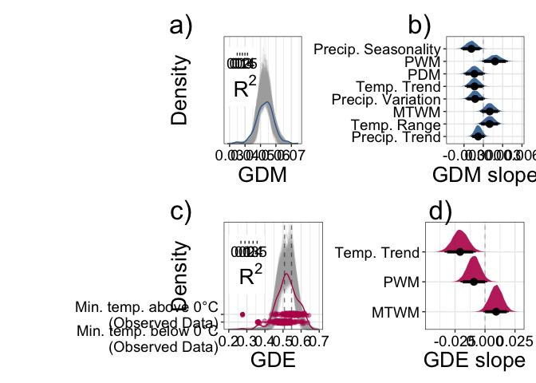
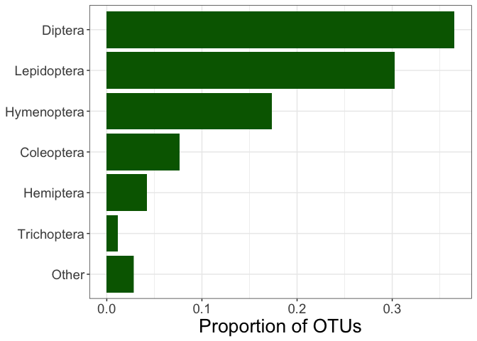
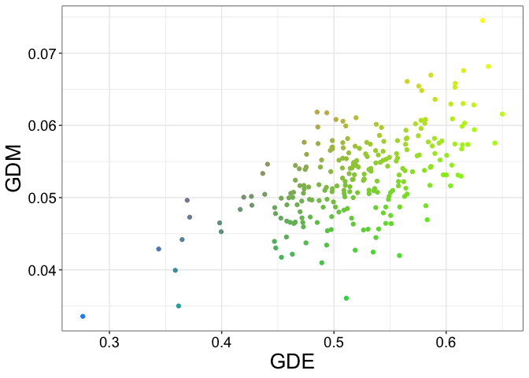
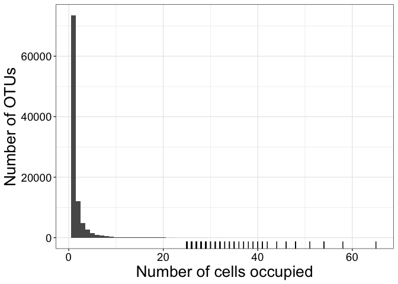

Publication Figures
================
Connor French

# Setup

Load packages

``` r
library(raster)
library(phytools)
library(HDInterval)
library(glmmfields)
library(tidyverse)
library(sf)
library(tidybayes)
library(patchwork)
library(here)
library(tmap)
library(gridExtra)
library(grid)
library(effectsize)
library(zoo)
library(scales)
library(ggspatial)
library(data.table)
library(bayesplot)
# remotes::install_github("matthewkling/colormap")
library(colormap)
library(viridis)
library(socorro) # custom package, download like this:
                 # `remotes::install_github('ajrominger/socorro')`
library(MCMCvis)

# source helper functions
source(here("R", "helper_functions.R"))
source(here("R", "modeling_fns.R"))

col_gdm <- "#366DA0FF"
col_gde <- "#B91657FF"

crs_behr <- "+proj=cea +lon_0=0 +lat_ts=30 +x_0=0 +y_0=0 +datum=WGS84 +ellps=WGS84 +units=m +no_defs"
```

``` r
### read in the two final models
# GDE
model_gde_full <- read_rds(here("output", "models", "glmm_gde.rds")) 

model_gde <- model_gde_full |> 
  pluck("min_otu_100")

# GDM
model_gdm_full <- read_rds(here("output", "models", "glmm_gdm.rds")) 

model_gdm <- model_gdm_full |> 
  pluck("min_otu_100")
```

Given that I will need to recreate figures independently, rather than in
the order that they are positioned in the document, I am loading data
for each figure independently. So, data may get loaded redundantly. The
only data I’m reading in at the beginning are the two models

# Main figurers

## GDE conceptual figure

The rank plots are adapted from Andy Rominger’s code in `R/GDE_figs.R`.
I took the panes generated here and paneled them together with some
modifications and illustrations in Inkscape.

Set up parameters

``` r
# make example distributions (with high and low evenness)
xx <- seq(0, 9, length.out = 100)
pp <- ((1:length(xx)) - 0.5) / length(xx)

#hiEvenDist <- dgamma(xx, 6, 2.5)
hiEvenRank_loGDM <- qgamma(pp, 6, 2.5, lower.tail = FALSE)
hiEvenRank_hiGDM <- qgamma(pp, 10, 2.5, lower.tail = FALSE)

loEvenRank <- qgamma(pp, 1, 0.4, lower.tail = FALSE)

loEvenRank_hiGDM <- qbeta(pp, 0.5, 10, lower.tail = FALSE)
loEvenRank_loGDM <- qbeta(pp, 0.5, 5, lower.tail = FALSE)


# colors for high and low
loCol <- "#E6550D"
hiCol <- "#FDAE6B"

# plotting pars
ppars <- list(mar = c(2, 2, 2, 0) + 0.5, mgp = c(1, 0, 0), cex = 1.2)
```

Make plots

### Tree visualization

Simulate a tree

``` r
tip_labels <- paste0("OTU_", 1:20)

tip_labels[c(1, 4, 10:15, 16, 17)] <- " "


set.seed(19761976)
species_tree <- rtree(20, br = runif, tip.label = tip_labels)
gd_vals <- species_tree$edge.length[1:20] * 0.1
gd_vals[c(1, 4, 10:15, 16, 17)] <- FALSE

names(gd_vals) <- tip_labels

dotTree(species_tree, x = gd_vals, legend = FALSE, colors = "darkgreen")
```

<!-- -->

Write tree to file

``` r
pdf(here("output", "publication_figs", "species_tree.pdf"), width = 4, height = 4)

dotTree(species_tree, x = gd_vals, legend = FALSE, colors = "darkgreen")

dev.off()
```

Coalescent tree

``` r
tip_labels_coal <- paste0("Ind_", 1:10)

# just randomly simulated coalescent trees in ape until I got coalescent trees with comparatively high and low depths
set.seed(16)
coal_tree_low_gd <- rcoal(10, tip.label = tip_labels_coal)

set.seed(20)
coal_tree_hi_gd <- rcoal(10, tip.label = tip_labels_coal)

plotTree(coal_tree_low_gd)
```

<!-- -->

``` r
plotTree(coal_tree_hi_gd)
```

<!-- -->

Write trees to file

``` r
# actually looks like a high GD tree
pdf(here("output", "publication_figs", "coalescent_tree_low_gd.pdf"), width = 4, height = 4)

plotTree(coal_tree_low_gd)

dev.off()

# actually looks like a low GD tree- the long basal branches make it high GD. Scaling it in Inkscape.
pdf(here("output", "publication_figs", "coalescent_tree_high_gd.pdf"), width = 4, height = 4)

plotTree(coal_tree_hi_gd)

dev.off()
```

### GDE shape

High GDE, High GDM

``` r
# plot ranks
pdf(here("output", "publication_figs", "hi_GDE_hi_GDM.pdf"), width = 4, height = 4)
par(ppars)

plot(pp, hiEvenRank_hiGDM, ylim = range(loEvenRank, hiEvenRank_hiGDM), type = 'n',
     xlab = "", ylab = "",
     axes = FALSE, frame.plot = TRUE)

polygon(c(pp, 1, min(pp)), c(hiEvenRank_hiGDM, 0, 0), col = colAlpha("darkorange", 0.5),
        border = NA)

lines(pp, hiEvenRank_hiGDM, col = "darkorange", lwd = 2)

dev.off()
```

    ## quartz_off_screen 
    ##                 2

Low GDE, High GDM

``` r
# plot ranks
pdf(here("output", "publication_figs", "low_GDE_hi_GDM.pdf"), width = 4, height = 4)
par(ppars)

plot(pp, loEvenRank, ylim = range(loEvenRank, hiEvenRank_hiGDM), type = 'n',
     xlab = "", ylab = "",
     axes = FALSE, frame.plot = TRUE)

polygon(c(pp, 1, min(pp)), c(loEvenRank, 0, 0), col = colAlpha("darkorange", 1.0),
        border = NA)

lines(pp, loEvenRank, col = "darkorange", lwd = 2)

dev.off()
```

    ## quartz_off_screen 
    ##                 2

High GDE, Low GDM

``` r
# plot ranks
pdf(here("output", "publication_figs", "hi_GDE_low_GDM.pdf"), width = 4, height = 4)
par(ppars)

plot(pp, hiEvenRank_loGDM, ylim = range(loEvenRank, hiEvenRank_hiGDM), type = 'n',
     xlab = "", ylab = "",
     axes = FALSE, frame.plot = TRUE)

polygon(c(pp, 1, min(pp)), c(hiEvenRank_loGDM, 0, 0), col = colAlpha("darkorange", 0.5),
        border = NA)

lines(pp, hiEvenRank_loGDM, col = "darkorange", lwd = 2)

dev.off()
```

    ## quartz_off_screen 
    ##                 2

Low GDE, Low GDM

``` r
# plot ranks
pdf(here("output", "publication_figs", "low_GDE_low_GDM.pdf"), width = 4, height = 4)
par(ppars)

plot(pp, loEvenRank * 0.7, ylim = range(loEvenRank, hiEvenRank_hiGDM), type = 'n',
     xlab = "", ylab = "",
     axes = FALSE, frame.plot = TRUE)

polygon(c(pp, 1, min(pp)), c(loEvenRank * 0.7, 0, 0), col = colAlpha("darkorange", 1.0),
        border = NA)

lines(pp, loEvenRank * 0.7, col = "darkorange", lwd = 2)

dev.off()
```

    ## quartz_off_screen 
    ##                 2

## Posterior summary figure

### Data processing

Read in data.

``` r
model_data <- read_sf(here("output", "spreadsheets", "full_sf.geojson"), crs = crs_behr) |> 
  filter(cell %in% model_gde$data$cell)
```

Sample posteriors for the figure. I’m retrieving the response posterior
and the beta posteriors

``` r
set.seed(97996)
# GDE posteriors
response_posts_gde <- sample_response_posterior(model_gde)

param_posts_gde <- tidy_post(model_gde)

# GDM posteriors
set.seed(4234887)
response_posts_gdm <- sample_response_posterior(model_gdm, response = "gdm")

param_posts_gdm <- tidy_post(model_gdm)
```

New data frames for the GDE freeze line division and boxplot.

``` r
gde_frz_line <- model_data |> 
  group_by(min_temp) |> 
  summarize(gde_median = median(gde)) |> 
  pivot_wider(names_from = "min_temp", values_from = "gde_median")

# changing names for min_temp variable for appropriate labels in boxplot
df_boxplot <- model_data |> 
  mutate(min_temp = fct_relevel(min_temp, "tropical", "temperate")) |> 
  mutate(min_temp = case_when(
    min_temp == "tropical" ~ "Min. temp. above 0°C\n(Observed Data)",
    min_temp == "temperate" ~ "\n\nMin. temp. below 0°C\n(Observed Data)"
  ))
```

``` r
r2_df_gde <- tibble(
  r2_curr_clim =  bayes_R2_glmmfields(model_gde)[,1]
) |> 
  pivot_longer(cols = everything(),
               names_to = "model",
               values_to = "post")

r2_df_gdm <- tibble(
  r2_curr_clim =  bayes_R2_glmmfields(model_gdm)[,1]
) |> 
  pivot_longer(cols = everything(),
               names_to = "model",
               values_to = "post")
```

### Figure

#### R2

``` r
r2_gdm_plot <- ggplotGrob(ggplot(data = r2_df_gdm, aes(x = post)) +
  geom_density(color = col_gdm, linewidth = 1) +
  geom_density(fill = col_gdm, color = "transparent", alpha = 0.4) +
  labs(x = bquote(~R^2)) +
  theme_insects() +
  theme(axis.title.y = element_blank(),
        axis.text.y = element_blank(),
        axis.ticks.y = element_blank(),
        panel.grid = element_blank()))
```

``` r
r2_gde_plot <- ggplotGrob(ggplot(data = r2_df_gde, aes(x = post)) +
  geom_density(color = col_gde, linewidth = 1) +
  geom_density(fill = col_gde, color = "transparent", alpha = 0.4) +
  labs(x = bquote(~R^2)) +
  theme_insects() +
  theme(axis.title.y = element_blank(),
        axis.text.y = element_blank(),
        axis.ticks.y = element_blank(),
        panel.grid = element_blank()))
```

#### Posterior panes

GDE posterior pane. Will need to move the y-axis label in inkscape.

``` r
gde_posterior <- ggplot() +
  geom_density(data = response_posts_gde, 
               aes(x = response_post, 
                   group = draw), 
               color = alpha("darkgray", 0.1)) +
  geom_density(data = model_data,
               aes(x = gde),
               color = col_gde) +
  geom_vline(xintercept = gde_frz_line$temperate, 
             alpha = 0.5,
             linetype = 2) +
  geom_vline(xintercept = gde_frz_line$tropical, 
             alpha = 0.5,
             linetype = 2) +
  geom_boxplot(data = df_boxplot, aes(x = gde, y = min_temp), color = col_gde) +
  geom_jitter(data = df_boxplot, aes(x = gde, y = min_temp), color = col_gde, alpha = 0.4, height = 0.2) + 
  labs(x = "GDE",
       y = "Density") +
  annotation_custom(grob = r2_gde_plot, 
                        xmin = 0.2, 
                        xmax = 0.4,
                        ymin = 5, 
                        ymax = 12) +
  theme_insects() +
  theme(axis.title.y = element_text(margin = ggplot2::margin(t = 0, r = -50, b = 0, l = 0)),
        plot.margin = unit(c(5.5, 5.5, 5.5, 65.5), "points"))
```

``` r
gde_posterior
```

<!-- -->

GDM posterior pane.

``` r
gdm_posterior <- ggplot() + 
  geom_density(data = response_posts_gdm, 
               aes(x = response_post, 
                   group = draw), 
               color = alpha("darkgray", 0.1)) +
  geom_density(data = model_data,
               aes(x = gdm),
               color = col_gdm) +
  labs(x = "GDM",
       y = "Density") +
  scale_y_continuous(expand = c(0, 0)) +
  annotation_custom(grob = r2_gdm_plot, 
                        xmin = 0.028, 
                        xmax = 0.047,
                        ymin = 70, 
                        ymax = 160) +
  theme_insects() +
  theme(axis.text.y = element_blank(),
        axis.ticks.y = element_blank(),
        panel.grid.major.y = element_blank(),
        panel.grid.minor.y = element_blank())
```

``` r
gdm_posterior
```

<!-- -->

#### Beta posterior panes

Posteriors for GDE

``` r
hpd_gde <- param_posts_gde$B |> 
  pivot_longer(everything(), names_to = "beta", values_to = "posterior") |> 
  group_by(beta) |> 
  summarize(
    median = median(posterior),
    hpd_95_hi = HDInterval::hdi(posterior, credMass = 0.95)["upper"],
    hpd_95_low = HDInterval::hdi(posterior, credMass = 0.95)["lower"],
    hpd_90_hi = HDInterval::hdi(posterior, credMass = 0.90)["upper"],
    hpd_90_low = HDInterval::hdi(posterior, credMass = 0.90)["lower"],
    hpd_80_hi = HDInterval::hdi(posterior, credMass = 0.80)["upper"],
    hpd_80_low = HDInterval::hdi(posterior, credMass = 0.80)["lower"],
    hpd_70_hi = HDInterval::hdi(posterior, credMass = 0.70)["upper"],
    hpd_70_low = HDInterval::hdi(posterior, credMass = 0.70)["lower"],
    hpd_50_hi = HDInterval::hdi(posterior, credMass = 0.50)["upper"],
    hpd_50_low = HDInterval::hdi(posterior, credMass = 0.50)["lower"]
    )


beta_post_gde <- param_posts_gde$B |> 
  select(-intercept) |> 
  pivot_longer(everything(), 
               names_to = "parameter",
               values_to = "posterior") |> 
  mutate(parameter = case_when(
    str_detect(parameter, "bio_5") ~ "MTWM",
    str_detect(parameter, "bio_13") ~ "PWM",
    str_detect(parameter, "temp_trend") ~ "Temp. Trend"
  ),
    parameter = fct_reorder(parameter, abs(posterior))) |> 
  ggplot(aes(x = posterior, y = parameter)) + 
  geom_vline(xintercept = 0, linetype = "dashed", color = "darkgray", alpha = 0.7) +
  stat_halfeye(.width = c(0.90, 0.95), fill = col_gde, alpha = 0.9) +
  labs(x = "GDE slope", 
       y = NULL) +
  theme_insects() 
```

``` r
beta_post_gde
```

<!-- -->

Posteriors for GDM

``` r
hpd_gdm <- param_posts_gdm$B |> 
  pivot_longer(everything(), names_to = "beta", values_to = "posterior") |> 
  group_by(beta) |> 
  summarize(
    median = median(posterior),
    hpd_95_hi = HDInterval::hdi(posterior, credMass = 0.95)["upper"],
    hpd_95_low = HDInterval::hdi(posterior, credMass = 0.95)["lower"],
    hpd_90_hi = HDInterval::hdi(posterior, credMass = 0.90)["upper"],
    hpd_90_low = HDInterval::hdi(posterior, credMass = 0.90)["lower"],
    hpd_80_hi = HDInterval::hdi(posterior, credMass = 0.80)["upper"],
    hpd_80_low = HDInterval::hdi(posterior, credMass = 0.80)["lower"],
    hpd_70_hi = HDInterval::hdi(posterior, credMass = 0.70)["upper"],
    hpd_70_low = HDInterval::hdi(posterior, credMass = 0.70)["lower"],
    hpd_50_hi = HDInterval::hdi(posterior, credMass = 0.50)["upper"],
    hpd_50_low = HDInterval::hdi(posterior, credMass = 0.50)["lower"]
    )


beta_post_gdm <- param_posts_gdm$B |> 
  select(-intercept) |> 
  pivot_longer(everything(), 
               names_to = "parameter",
               values_to = "posterior") |> 
  mutate(parameter = case_when(
    str_detect(parameter, "bio_5") ~ "MTWM",
    str_detect(parameter, "bio_15") ~ "Precip. Seasonality",
    str_detect(parameter, "precip_trend") ~ "Precip. Trend",
    str_detect(parameter, "bio_2") ~ "Temp. Range",
    str_detect(parameter, "temp_trend") ~ "Temp. Trend",
    str_detect(parameter, "precip_var") ~ "Precip. Variation",
    str_detect(parameter, "bio_13") ~ "PWM",
    str_detect(parameter, "bio_14") ~ "PDM",
  ),
    parameter = fct_reorder(parameter, abs(posterior))) |> 
  ggplot(aes(x = posterior, y = parameter)) + 
  geom_vline(xintercept = 0, linetype = "dashed", color = "darkgrey", alpha = 0.7) +
  stat_halfeye(.width = c(0.90, 0.95), fill = col_gdm, alpha = 0.9) +
  labs(x = "GDM slope", 
       y = NULL) +
  theme_insects()  
```

``` r
beta_post_gdm
```

<!-- -->

``` r
full_posterior_plot <- 
  (gdm_posterior + beta_post_gdm) / 
  (gde_posterior + beta_post_gde) + 
  plot_annotation(tag_levels = "a", tag_suffix = ")") &
  theme(axis.title.y = element_text(margin = ggplot2::margin(
    t = 0,
    r = -200,
    b = 0,
    l = 0
  )),
  plot.tag = element_text(margin = ggplot2::margin(
    t = 0,
    r = -200,
    b = 0,
    l = 0
  ), size = 25))
```

``` r
full_posterior_plot
```

<!-- -->

Write to file. For whatever reason, panel tag **d)** moves too far to
the right, so I have to edit it in Inkscape.

``` r
ggsave(filename = here("output", "publication_figs", "posterior_fig.pdf"),
       plot = full_posterior_plot,
       width = 36,
       height = 22.5,
       dpi = 300,
       unit = "cm")
```

## Order sampling figure

Read in data and do some wrangling

``` r
raw_pi <- read_csv(here("output", "spreadsheets", "cell_medium_3_10_pi.csv"))

full_sf_100 <- read_sf(here("output", "spreadsheets", "full_sf.geojson")) |> 
  filter(num_otu >= 100)

pw_pi_filt <- raw_pi |> 
  filter(cell %in% full_sf_100$cell)

pw_pi_prop <- pw_pi_filt |> 
  count(order, sort = TRUE) |> 
  mutate(prop = n / sum(n),
         order = as.character(order),
         order_summary = ifelse(prop < 0.01, "Other", order),
         order_summary = fct_reorder(order_summary, n)
         )
```

Write summary to csv

``` r
write_csv(pw_pi_prop, here("output", "spreadsheets", "otu_sampling.csv"))
```

Plot the figure  
“Other” includes the 20 other insect orders in the data set. I added
insect shapes to the figure in inkscape.

``` r
order_fig <- pw_pi_prop |> 
  ggplot(aes(x = order_summary, y = prop)) +
  geom_col(fill = "darkgreen") + 
  coord_flip() +
  theme_bw() +
  labs(y = "Proportion of OTUs") +
  theme(axis.title.y = element_blank(),
        axis.title.x = element_text(size = 20),
        axis.text = element_text(size = 14)) 
```

``` r
order_fig
```

<!-- -->

Save to file

``` r
ggsave(filename = here("output", "publication_figs", "order_summary_fig.pdf"),
       plot = order_fig,
       width = 24,
       height = 15,
       dpi = 300,
       unit = "cm")
```

## Prediction Maps

### Map helpers

``` r
# for mapping. 
world_base_map <- rnaturalearth::ne_countries(scale = "small", returnclass = "sf") |>
  select(continent, name_long) |> 
  st_transform(crs = "+proj=cea +lon_0=0 +lat_ts=30 +x_0=0 +y_0=0 +datum=WGS84 +ellps=WGS84 +units=m +no_defs") |> 
  filter(continent != "Antarctica",
         !is.na(continent))

# basemap for mapping. 
world_base_coast <- rnaturalearth::ne_coastline(scale = "large", returnclass = "sf") |> 
  st_transform(crs = "+proj=cea +lon_0=0 +lat_ts=30 +x_0=0 +y_0=0 +datum=WGS84 +ellps=WGS84 +units=m +no_defs") |> 
  st_join(world_base_map) |> 
  filter(continent != "Antarctica")
```

``` r
plot(world_base_coast |> st_geometry())
```

<!-- -->

Read in and wrangle data

``` r
mess_gde_sf <- read_rds(here("output", "models", "mess_gde.rds")) |> 
  pluck("min_otu_100") |> 
  st_set_crs(crs_behr)

mess_gdm_sf <- read_rds(here("output", "models", "mess_gdm.rds")) |> 
  pluck("min_otu_100") |> 
  st_set_crs(crs_behr)

map_sf_gde <-read_rds(here("output", "spreadsheets", "full_preds_sf_gde.rds")) |> 
  pluck("min_otu_100") |> 
  st_set_crs(crs_behr) |> 
  st_join(mess_gde_sf |> select(mess_binary), st_equals) |> 
  # mask out the values in non-analogous climate
  mutate(
    across(where(is.double), ~if_else(mess_binary == "non_analogous", NA_real_, .x), .names = "mask_{.col}")
  ) 

map_sf_filt_gde <- map_sf_gde[world_base_map, , op = st_intersects]

map_sf_gdm <- read_rds(here("output", "spreadsheets", "full_preds_sf_gdm.rds")) |> 
  pluck("min_otu_100") |> 
  st_set_crs(crs_behr) |> 
  st_join(mess_gdm_sf |> select(mess_binary), st_equals) |> 
  # mask out the values in non-analogous climate
  mutate(
    across(where(is.double), ~if_else(mess_binary == "non_analogous", NA_real_, .x), .names = "mask_{.col}")
  ) 

map_sf_filt_gdm <- map_sf_gdm[world_base_map, , op = st_intersects]

# global freeze-line
fl <- suppressWarnings(read_sf(here("data", "climate_poly", "freeze_line_smoothed.geojson"), crs = crs_behr))

# posterior samples of beta parameters
set.seed(9976)
beta_posts_gde <- tidy_post(model_gde)$B |> 
  sample_n(500) |> 
  mutate(draw = row_number())

set.seed(8436)
beta_posts_gdm <- tidy_post(model_gdm)$B |> 
  sample_n(500) |> 
  mutate(draw = row_number())
```

### GDM

``` r
map_sf_filt_gdm <- map_sf_filt_gdm |> 
  mutate(mess_binary_cols = if_else(mess_binary == "non_analogous", "gray", "transparent"))

map_gdm <- suppressWarnings(map_pred(map_sf_filt_gdm, resp = "GDM")) + labs(title = "Predicted GDM")
```

``` r
map_gdm
```

<!-- -->

### GDE

``` r
map_sf_filt_gde <- map_sf_filt_gde |> 
  mutate(mess_binary_cols = if_else(mess_binary == "non_analogous", "gray", "transparent"))

map_gde <- suppressWarnings(map_pred(map_sf_filt_gde, resp = "GDE", freezeline = TRUE)) + labs(title = "Predicted GDE")
```

``` r
map_gde
```

<!-- -->

### 2D

``` r
map_sf_combo <- st_join(map_sf_filt_gde, 
                        map_sf_filt_gdm, 
                        left = FALSE) |>
  filter(!duplicated(cell.x)) |> 
  select(mask_.pred.x, mask_.pred.y) |> 
  na.omit()

color_df <- map_sf_combo |> 
  as_tibble() |> 
  select(mask_.pred.x, mask_.pred.y)

# for some reason, when this document is rendered, rmarkdown doesn't recognize this function
# so, saved the colors as an rds object to load
# color_vec <- colors2d(data = color_df, colors = c("yellow", "green", "dodgerblue", "magenta"), xtrans = "log", ytrans = "log")
# write_rds(color_vec, here("output", "spreadsheets", "colors_2d.rds"))
color_vec <- read_rds(here("output", "spreadsheets", "colors_2d.rds"))
```

``` r
map_2d <- suppressWarnings(map_pred(map_sf_combo, resp = "combo")) + labs(title = "Predicted GDM x GDE")
```

``` r
map_2d
```

<!-- -->

### Combo map

``` r
combo_map <- map_gdm / map_gde / map_2d + plot_annotation(tag_levels = "a",
                                                          tag_suffix = ")") &
  theme(plot.tag = element_text(size = 25))
```

``` r
combo_map
```

<!-- -->

Write figure to file

``` r
ggsave(filename = here("output", "publication_figs", "map_fig.svg"),
       plot = combo_map,
       width = 36,
       height = 36,
       dpi = 300,
       unit = "cm")
```

### GD variation maps

These are actually for supplementary, but I don’t want to copy-paste all
of that code.

#### GDM

``` r
lims_gdm <- c(min(na.omit(map_sf_filt_gdm$mask_conf_low)), max(na.omit(map_sf_filt_gdm$mask_conf_high)))

map_gdm_u95 <- ggplot() +
  geom_sf(data = map_sf_filt_gdm, aes(fill = mask_conf_high, color = mask_conf_high)) +
  scale_fill_viridis_c(option = "mako",
                       direction = 1,
                       limits = lims_gdm) +
  scale_color_viridis_c(option = "mako",
                        direction = 1,
                        guide = "none", 
                        limits = lims_gdm) +
    geom_sf(data = map_sf_filt_gdm,
          color = map_sf_filt_gdm$mess_binary_cols,
          fill = map_sf_filt_gdm$mess_binary_cols) +
  geom_sf(data = world_base_coast, fill = "transparent") +
  coord_sf(expand = FALSE) +
  labs(fill = "GDM, Upper 95% HDI") +
  theme_insects()

map_gdm_l95 <- ggplot() +
  geom_sf(data = map_sf_filt_gdm, aes(fill = mask_conf_low, color = mask_conf_low)) +
  scale_fill_viridis_c(option = "mako",
                       direction = 1,
                       limits = lims_gdm) +
  scale_color_viridis_c(option = "mako",
                        direction = 1,
                        guide = "none", limits = lims_gdm) +
    geom_sf(data = map_sf_filt_gdm, 
          color = map_sf_filt_gdm$mess_binary_cols,
          fill = map_sf_filt_gdm$mess_binary_cols) +
  geom_sf(data = world_base_coast, fill = "transparent") +
  coord_sf(expand = FALSE) +
  labs(fill = "GDM, Lower 95% HDI") +
  theme_insects()
```

#### GDE

These are actually for supplementary, but I don’t want to copy-paste all
of that code.

``` r
lims_gde <- c(min(na.omit(map_sf_filt_gde$mask_conf_low)), max(na.omit(map_sf_filt_gde$mask_conf_high)))

map_gde_u95 <- ggplot() +
  geom_sf(data = map_sf_filt_gde, aes(fill = mask_conf_high, color = mask_conf_high)) +
  scale_fill_viridis_c(option = "rocket",
                       direction = 1,
                       limits = lims_gde) +
  scale_color_viridis_c(option = "rocket",
                        direction = 1,
                        guide = "none", limits = lims_gde) +
    geom_sf(data = map_sf_filt_gde,
          color = map_sf_filt_gde$mess_binary_cols,
          fill = map_sf_filt_gde$mess_binary_cols) +
  geom_sf(data = world_base_coast, fill = "transparent") +
  coord_sf(expand = FALSE) +
  labs(fill = "GDE, Upper 95% HDI") +
  theme_insects()

map_gde_l95 <- ggplot() +
  geom_sf(data = map_sf_filt_gde, aes(fill = mask_conf_low, color = mask_conf_low)) +
  scale_fill_viridis_c(option = "rocket",
                       direction = 1,
                       limits = lims_gde) +
  scale_color_viridis_c(option = "rocket",
                        direction = 1,
                        guide = "none", limits = lims_gde) +
    geom_sf(data = map_sf_filt_gde, 
          color = map_sf_filt_gde$mess_binary_cols,
          fill = map_sf_filt_gde$mess_binary_cols) +
  geom_sf(data = world_base_coast, fill = "transparent") +
  coord_sf(expand = FALSE) +
  labs(fill = "GDE, Lower 95% HDI") +
  theme_insects() 
```

#### Combo

``` r
gd_var_map <-
  map_gdm_u95 +
  map_gdm_l95 +
  map_gde_u95 + 
  map_gde_l95 + 
  plot_layout(ncol = 1) + 
  plot_annotation(tag_levels = "a", tag_suffix = ")") &
  theme(plot.tag = element_text(size = 25))
```

``` r
gd_var_map
```

<!-- -->

``` r
ggsave(filename = here("output", "publication_figs", "gd_var_map_fig.svg"),
       plot = gd_var_map,
       width = 36,
       height = 36,
       dpi = 300,
       unit = "cm")
```

### Residuals

Maps of residuals. Also supplementary.

``` r
resid_map_gdm <- map_resids(map_sf_filt_gdm, sumstat = "gdm", n_otu = 100)
resid_map_gde <- map_resids(map_sf_filt_gde, sumstat = "gde", n_otu = 100)

resid_map <-
  resid_map_gdm +
  resid_map_gde +
  plot_layout(ncol = 1) + 
  plot_annotation(tag_levels = "a", tag_suffix = ")") &
  theme(plot.tag = element_text(size = 25))
```

``` r
resid_map
```

<!-- -->

``` r
ggsave(filename = here("output", "publication_figs", "resid_map_fig.svg"),
       plot = resid_map,
       width = 24,
       height = 24,
       dpi = 300,
       unit = "cm")
```

## Observed Maps

Map helpers

``` r
# for mapping. this will be smaller so plotting is faster
world_base_map <- rnaturalearth::ne_countries(scale = "small", returnclass = "sf") |>
  select(continent, name_long) |> 
  st_transform(crs = "+proj=cea +lon_0=0 +lat_ts=30 +x_0=0 +y_0=0 +datum=WGS84 +ellps=WGS84 +units=m +no_defs") |> 
  filter(continent != "Antarctica")
```

Read in data

``` r
spatial_df_full <- read_sf(here("output", "spreadsheets", "full_sf.geojson"), crs = crs_behr) 

spatial_df <- spatial_df_full |> 
  filter(num_otu >= 100)

fl <- suppressWarnings(read_sf(here("data", "climate_poly", "freeze_line_smoothed.geojson"), crs = crs_behr))
```

### Min = 100

``` r
obs_gde_map <- suppressWarnings(plot_obs(df = spatial_df, resp = "GDE", trend = TRUE, freezeline = TRUE, legend_in = TRUE)) + labs(title = "Observed GDE")

obs_gdm_map <- suppressWarnings(plot_obs(df = spatial_df, resp = "GDM", trend = FALSE, legend_in = TRUE)) + labs(title = "Observed GDM")
```

2D map

``` r
color_df_obs <- spatial_df |> 
  as_tibble() |> 
  select(gde, gdm)

# for some reason, when this document is rendered, rmarkdown doesn't recognize this function
# so, saved the colors as an rds object to load
# color_vec_obs <- colors2d(data = color_df_obs, colors = c("yellow", "green", "dodgerblue", "magenta"), xtrans = "log", ytrans = "log")
# write_rds(color_vec_obs, here("output", "spreadsheets", "colors_2d_observed.rds"))
color_vec_obs <- read_rds(here("output", "spreadsheets", "colors_2d_observed.rds"))


obs_2d_map <- suppressWarnings(plot_obs(df = spatial_df, resp = "combo")) + labs(title = "Observed GDM x GDE")
```

``` r
obs_2d_map
```

<!-- -->

Combined map

``` r
obs_combo_map <- obs_gdm_map / obs_gde_map / obs_2d_map + plot_annotation(
  tag_levels = "a", 
  tag_suffix = ")") &
  theme(plot.tag = element_text(size = 25))
```

``` r
obs_combo_map
```

<!-- -->

Write map to file

``` r
ggsave(filename = here("output", "publication_figs", "obs_map_fig.pdf"),
       plot = obs_combo_map,
       width = 36,
       height = 36,
       dpi = 300,
       unit = "cm")
```

### All thresholds

``` r
otu_thresh <- c(min_10 = 10, min_25 = 25, min_50 = 50, min_100 = 100, min_150 = 150, min_200 = 200)
otu_names <- names(otu_thresh)

sp_df_list <- map(otu_thresh, ~filter(spatial_df_full, num_otu >= .x))

sp_maps_list_gdm <- suppressWarnings(map2(sp_df_list, otu_names, ~plot_obs(df = .x, title = .y, resp = "GDM", legend_in = TRUE)))
sp_maps_list_gde <- suppressWarnings(map2(sp_df_list, otu_names, ~plot_obs(df = .x, title = .y, resp = "GDE", legend_in = TRUE)))
```

``` r
sp_maps_fig <- sp_maps_list_gdm[[1]] + sp_maps_list_gde[[1]] +
  sp_maps_list_gdm[[2]] + sp_maps_list_gde[[2]] +
  sp_maps_list_gdm[[3]] + sp_maps_list_gde[[3]] +
  sp_maps_list_gdm[[4]] + sp_maps_list_gde[[4]] +
  sp_maps_list_gdm[[5]] + sp_maps_list_gde[[5]] +
  sp_maps_list_gdm[[6]] + sp_maps_list_gde[[6]] +
  plot_layout(ncol = 2) +
  plot_annotation(tag_levels = "a", tag_suffix = ")") &
  theme(plot.tag = element_text(size = 25))
```

``` r
ggsave(filename = here("output", "publication_figs", "supp_obs_maps.svg"),
       plot = sp_maps_fig,
       width = 52,
       height = 75,
       dpi = 300,
       unit = "cm")
```

## Full map figure

Combination of the prediction and observed maps for the manuscript. Code
from the `Prediction Maps` and `Observed Maps` sections needs to be run
before this one.

``` r
full_combo_map <- 
  (obs_gdm_map + map_gdm) / (obs_gde_map + map_gde) / (obs_2d_map + map_2d) +
  plot_annotation(tag_levels = "a", tag_suffix = ")") &
  theme(plot.tag = element_text(size = 25))
```

``` r
full_combo_map
```

<!-- -->

Write to file

``` r
ggsave(filename = here("output", "publication_figs", "full_map_fig.svg"),
       plot = full_combo_map,
       width = 58.25,
       height = 36,
       dpi = 300,
       unit = "cm")
```

## Hotspot maps

Map helpers

``` r
# for mapping. 
world_base_map <- rnaturalearth::ne_countries(scale = "small", returnclass = "sf") |>
  select(continent, name_long) |> 
  st_transform(crs = "+proj=cea +lon_0=0 +lat_ts=30 +x_0=0 +y_0=0 +datum=WGS84 +ellps=WGS84 +units=m +no_defs") |> 
  filter(continent != "Antarctica")

# basemap for mapping. 
world_base_coast <- rnaturalearth::ne_coastline(scale = "large", returnclass = "sf") |> 
  st_transform(crs = "+proj=cea +lon_0=0 +lat_ts=30 +x_0=0 +y_0=0 +datum=WGS84 +ellps=WGS84 +units=m +no_defs") |> 
  st_join(world_base_map) |> 
  filter(continent != "Antarctica")
```

Read in and wrangle data

``` r
mess_gde_sf <- read_rds(here("output", "models", "mess_gde.rds")) |> 
  pluck("min_otu_100") |> 
  st_set_crs(crs_behr)

mess_gdm_sf <- read_rds(here("output", "models", "mess_gdm.rds")) |> 
  pluck("min_otu_100") |> 
  st_set_crs(crs_behr)

map_sf_gde <-read_rds(here("output", "spreadsheets", "full_preds_sf_gde.rds")) |> 
  pluck("min_otu_100") |> 
  st_set_crs(crs_behr) |> 
  st_join(mess_gde_sf |> select(mess_binary), st_equals) |> 
  # mask out the values in non-analogous climate
  mutate(
    across(where(is.double), ~if_else(mess_binary == "non_analogous", NA_real_, .x), .names = "mask_{.col}")
  ) 

map_sf_filt_gde <- map_sf_gde[world_base_map, , op = st_intersects]

map_sf_gdm <- read_rds(here("output", "spreadsheets", "full_preds_sf_gdm.rds")) |> 
  pluck("min_otu_100") |> 
  st_set_crs(crs_behr) |> 
  st_join(mess_gdm_sf |> select(mess_binary), st_equals) |> 
  # mask out the values in non-analogous climate
  mutate(
    across(where(is.double), ~if_else(mess_binary == "non_analogous", NA_real_, .x), .names = "mask_{.col}")
  ) 

map_sf_filt_gdm <- map_sf_gdm[world_base_map, , op = st_intersects]

# global freeze-line
fl <- suppressWarnings(read_sf(here("data", "climate_poly", "freeze_line_smoothed.geojson"), crs = crs_behr))


spatial_df <- read_sf(here("output", "spreadsheets", "full_sf.geojson"), crs = crs_behr) |> 
  filter(num_otu >= 100)


# only keep the predictions that overlap with a map polygon
map_sf_filt_gde <- map_sf_gde[world_base_map, , op = st_intersects]

map_sf_filt_gdm <- map_sf_gdm[world_base_map, , op = st_intersects]
```

### 2D

#### Hotspot

Hotspot wrangling

``` r
#### Predicted hotspots
# filter data for "hotspots" with the top 10% of values for GDE and GDM
map_sf_gde_hs <- map_sf_filt_gde |> 
  arrange(desc(mask_.pred)) |> 
  slice_head(prop = 0.1)

map_sf_gdm_hs <- map_sf_filt_gdm |> 
  arrange(desc(mask_.pred)) |> 
  slice_head(prop = 0.1)

# only keep cells that overlap between the two data sets
map_sf_hs <- map_sf_gdm_hs[map_sf_gde_hs, , op = st_intersects]

##### Observed hotspots
map_obs_gde <- spatial_df |> 
  select(gde) |> 
  arrange(desc(gde)) |> 
  slice_head(prop = 0.1)

map_obs_gdm <- spatial_df |> 
  select(gdm) |> 
  arrange(desc(gdm)) |> 
  slice_head(prop = 0.1)

map_obs_hs <- map_obs_gdm[map_obs_gde, , op = st_intersects]
```

Hotspot map of predicted values

``` r
hotspot_predicted <- ggplot() +
  geom_sf(data = world_base_coast, fill = "transparent") +
  geom_sf(data = map_sf_hs, fill = "red", color = "red") +
  labs(title = "GDM x GDE hotspots, predicted values") +
  theme_insects()
```

``` r
hotspot_predicted
```

<!-- -->

Observed hotspot map

``` r
hotspot_observed <- ggplot() +
  geom_sf(data = world_base_coast, fill = "transparent") +
  geom_sf(data = spatial_df, fill = "gray", color = "gray") +
  geom_sf(data = map_obs_hs, fill = "red", color = "red") +
  labs(title = "GDM x GDE hotspots, observed values") +
  theme_insects() 
```

``` r
hotspot_observed
```

<!-- -->

#### Coldspot

``` r
#### Predicted coldspots
# filter data for "coldspots" with the top 15% of values for GDE and GDM
map_sf_gde_cs <- map_sf_filt_gde |> 
  arrange(mask_.pred) |> 
  slice_head(prop = 0.1) 

map_sf_gdm_cs <- map_sf_filt_gdm |> 
  arrange(mask_.pred) |> 
  slice_head(prop = 0.1)

# only keep cells that overlap between the two data sets
map_sf_cs <- map_sf_gdm_cs[map_sf_gde_cs, , op = st_intersects]

##### Observed coldspots
map_obs_gde_cs <- spatial_df |> 
  select(gde) |> 
  arrange(gde) |> 
  slice_head(prop = 0.1) 

map_obs_gdm_cs <- spatial_df |> 
  select(gdm) |> 
  arrange(gdm) |> 
  slice_head(prop = 0.1)

map_obs_cs <- map_obs_gdm_cs[map_obs_gde_cs, , op = st_intersects]
```

Coldspot map of predicted values

``` r
coldspot_predicted <- ggplot() +
  geom_sf(data = world_base_coast, fill = "transparent") +
  geom_sf(data = map_sf_cs, fill = "blue", color = "blue") +
  labs(title = "GDM x GDE coldspots, predicted values") +
  theme_insects()
```

``` r
coldspot_predicted
```

<!-- -->

Observed coldspot map

``` r
coldspot_observed <- ggplot() +
  geom_sf(data = world_base_coast, fill = "transparent") +
  geom_sf(data = spatial_df, fill = "gray", color = "gray") +
  geom_sf(data = map_obs_cs, fill = "blue", color = "blue") +
  labs(title = "GDM x GDE coldspots, observed values") +
  theme_insects()
```

``` r
coldspot_observed
```

<!-- -->

### GDM

#### Predicted

``` r
hotspot_predicted_gdm <- ggplot() +
  geom_sf(data = world_base_coast, fill = "transparent") +
  geom_sf(data = map_sf_gdm_hs, fill = "red", color = "red") +
  labs(title = "GDM hotspots, predicted values") +
  theme_insects() 
```

``` r
hotspot_predicted_gdm
```

<!-- -->

``` r
coldspot_predicted_gdm <- ggplot() +
  geom_sf(data = world_base_coast, fill = "transparent") +
  geom_sf(data = map_sf_gdm_cs, fill = "blue", color = "blue") +
  labs(title = "GDM coldspots, predicted values") +
  theme_insects()
```

``` r
coldspot_predicted_gdm
```

<!-- -->

#### Observed

``` r
hotspot_observed_gdm <- ggplot() +
  geom_sf(data = world_base_coast, fill = "transparent") +
  geom_sf(data = spatial_df, fill = "gray", color = "gray") +
  geom_sf(data = map_obs_gdm, fill = "red", color = "red") +
  labs(title = "GDM hotspots, observed values") +
  theme_insects()
```

``` r
hotspot_observed_gdm
```

<!-- -->

``` r
coldspot_observed_gdm <- ggplot() +
  geom_sf(data = world_base_coast, fill = "transparent") +
  geom_sf(data = spatial_df, fill = "gray", color = "gray") +
  geom_sf(data = map_obs_gdm_cs, fill = "blue", color = "blue") +
  labs(title = "GDM coldspots, observed values") +
  theme_insects()
```

``` r
coldspot_observed_gdm
```

<!-- -->

### GDE

#### Predicted

``` r
hotspot_predicted_gde <- ggplot() +
  geom_sf(data = world_base_coast, fill = "transparent") +
  geom_sf(data = map_sf_gde_hs, fill = "red", color = "red") +
  labs(title = "GDE hotspots, predicted values") +
  theme_insects() 
```

``` r
hotspot_predicted_gde
```

<!-- -->

``` r
coldspot_predicted_gde <- ggplot() +
  geom_sf(data = world_base_coast, fill = "transparent") +
  geom_sf(data = map_sf_gde_cs, fill = "blue", color = "blue") +
  labs(title = "GDE coldspots, predicted values") +
  theme_insects()
```

``` r
coldspot_predicted_gde
```

<!-- -->

#### Observed

``` r
hotspot_observed_gde <- ggplot() +
  geom_sf(data = world_base_coast, fill = "transparent") +
  geom_sf(data = spatial_df, fill = "gray", color = "gray") +
  geom_sf(data = map_obs_gde, fill = "red", color = "red") +
  labs(title = "GDE hotspots, observed values") +
  theme_insects()
```

``` r
hotspot_observed_gde
```

<!-- -->

``` r
coldspot_observed_gde <- ggplot() +
  geom_sf(data = world_base_coast, fill = "transparent") +
  geom_sf(data = spatial_df, fill = "gray", color = "gray") +
  geom_sf(data = map_obs_gde_cs, fill = "blue", color = "blue") +
  labs(title = "GDE coldspots, observed values") +
  theme_insects()
```

``` r
coldspot_observed_gde
```

<!-- -->

#### Combo

I added titles and axis labels in inkscape because ggplot was being too
fussy.

``` r
combo_hs_cs_map <- 
  (hotspot_predicted + hotspot_observed) /
  (coldspot_predicted + coldspot_observed) /
  (hotspot_predicted_gdm + hotspot_observed_gdm) /
  (coldspot_predicted_gdm + coldspot_observed_gdm) /
  (hotspot_predicted_gde + hotspot_observed_gde) /
  (coldspot_predicted_gde + coldspot_observed_gde) +
  plot_annotation(
  tag_levels = "a", 
  tag_suffix = ")") &
  theme(plot.title = element_text(size = 25),
        plot.tag = element_text(size = 25))
```

``` r
combo_hs_cs_map
```

<!-- -->

Write to file

``` r
ggsave(filename = here("output", "publication_figs", "supp_hotspot_coldspot_map_fig.svg"),
       plot = combo_hs_cs_map,
       width = 36,
       height = 72,
       dpi = 300,
       unit = "cm")
```

### Observed 2D scatterplot

``` r
ggplot() +
  geom_sf(data = world_base_map, fill = "lightgray", color = "lightgray") +
  geom_sf(data = spatial_df, fill = color_vec_obs, color = color_vec_obs) +
  # geom_sf(data = psf) +
  # geom_sf(data = psf2) +
  # geom_sf(data = psf3, fill = "transparent", color = "black") +
  theme_insects()
```

<!-- -->

``` r
ggplot(data = spatial_df, aes(x = gde, 
                             y = gdm)) +
  geom_point(color = color_vec_obs) +
  labs(x = "GDE", y = "GDM") +
  theme_insects()
```

<!-- -->

# Supp Figs

## Order outliers

Read in data and filter, removing outlier orders. I’m only considering
the outlier data set that retains the same filtering regime as the
original data to keep things comparable. I initially explored multiple
filtering regimes since the number of cells is drastically reduced, but
the distributions look similar and it’s more logical to only compare the
data sets with the same filtering regime.

``` r
pw_pi <- read_csv(here("output", "spreadsheets", "cell_medium_3_10_pi.csv"))

analysis_data <- read_sf(here("output", "spreadsheets", "full_sf.geojson"),
                         crs = crs_behr) |> 
  filter(num_otu >= 100)

pw_pi_filt <- pw_pi |> 
  filter(cell %in% analysis_data$cell)

outlier_orders <- c("Diptera", "Lepidoptera", "Hymenoptera")

gd_no_outliers_100 <- pw_pi_filt |> 
  filter(order %notin% outlier_orders) |> 
  group_by(cell) |> 
  filter(uniqueN(bin_uri) >= 100) |> 
  summarize(hill = hill_calc(pi),
            avg_pi = sqrt(mean(pi))) |> 
  mutate(min_otu = "Top 3 orders removed\n(N=82)")

gd_everything <- pw_pi_filt |> 
  group_by(cell) |> 
  summarize(hill = hill_calc(pi),
            avg_pi = sqrt(mean(pi))) |> 
  mutate(min_otu = "Original\n(N=245)")

gd_all <- bind_rows(
  gd_no_outliers_100,
  gd_everything
)

glimpse(gd_all)
```

    ## Rows: 327
    ## Columns: 4
    ## $ cell    <dbl> 636, 643, 742, 943, 944, 1292, 1294, 1297, 1356, 1357, 1470, 1…
    ## $ hill    <dbl> 0.4454309, 0.4622727, 0.4581350, 0.5744267, 0.5767245, 0.48639…
    ## $ avg_pi  <dbl> 0.04147382, 0.04450441, 0.04649514, 0.05429685, 0.05352699, 0.…
    ## $ min_otu <chr> "Top 3 orders removed\n(N=82)", "Top 3 orders removed\n(N=82)"…

Boxplots comparing the GDE and GDM distributions.

``` r
gde_box <- gd_all |> 
  ggplot(aes(x = min_otu, y = hill)) +
  geom_boxplot(fill = "transparent") +
  geom_jitter(width = 0.25, alpha = 0.8) +
  labs(y = "GDE") +
  coord_flip() +
  theme_insects() +
  theme(axis.title.y = element_blank())

gdm_box <- gd_all |> 
  ggplot(aes(x = min_otu, y = avg_pi)) +
  geom_boxplot(fill = "transparent") +
  geom_jitter(width = 0.25, alpha = 0.8) +
  labs(y = "GDM") +
  coord_flip() +
  theme_insects() +
  theme(axis.title.y = element_blank())

all_box <- gdm_box / gde_box + 
  plot_annotation(tag_levels = "a", tag_suffix = ")")
```

``` r
all_box
```

<!-- -->

Save plot to file

``` r
ggsave(filename = here("output", "publication_figs", "gd_remove_outliers_supp_fig.svg"),
       plot = all_box,
       width = 24,
       height = 15,
       dpi = 300,
       unit = "cm")
```

Welch’s t-tests to determine whether the distribution of GD of the
complete data set is significantly different from the distribution of GD
with the top three orders removed, while keeping the minimum number of
OTU filter the same.

GDE does not significantly differ (Cohen’s D = -0.15, p = 0.335), but
GDM does (Cohen’s D = -0.50, p = 0.002).

``` r
gd_welch <- gd_all |> 
  #filter(min_otu %in% c("150", "everything")) |> 
  droplevels()

welch_gde <- t.test(hill ~ min_otu, data = gd_welch, var.equal = FALSE)
welch_gdm <- t.test(avg_pi ~ min_otu, data = gd_welch, var.equal = FALSE)

cohen_gde <- cohens_d(hill ~ min_otu, data = gd_welch, pooled_sd = FALSE)

cohen_gdm <- cohens_d(avg_pi ~ min_otu, data = gd_welch, pooled_sd = FALSE)

welch_gde
```

    ## 
    ##  Welch Two Sample t-test
    ## 
    ## data:  hill by min_otu
    ## t = -1.863, df = 131.45, p-value = 0.0647
    ## alternative hypothesis: true difference in means between group Original
    ## (N=245) and group Top 3 orders removed
    ## (N=82) is not equal to 0
    ## 95 percent confidence interval:
    ##  -0.0301628484  0.0009047472
    ## sample estimates:
    ##            mean in group Original\n(N=245) 
    ##                                  0.5215877 
    ## mean in group Top 3 orders removed\n(N=82) 
    ##                                  0.5362168

``` r
cohen_gde
```

    ## Cohen's d |        95% CI
    ## -------------------------
    ## -0.24     | [-0.50, 0.01]
    ## 
    ## - Estimated using un-pooled SD.

``` r
welch_gdm
```

    ## 
    ##  Welch Two Sample t-test
    ## 
    ## data:  avg_pi by min_otu
    ## t = -4.333, df = 122.44, p-value = 3.033e-05
    ## alternative hypothesis: true difference in means between group Original
    ## (N=245) and group Top 3 orders removed
    ## (N=82) is not equal to 0
    ## 95 percent confidence interval:
    ##  -0.005421859 -0.002021402
    ## sample estimates:
    ##            mean in group Original\n(N=245) 
    ##                                 0.05298152 
    ## mean in group Top 3 orders removed\n(N=82) 
    ##                                 0.05670315

``` r
cohen_gdm
```

    ## Cohen's d |         95% CI
    ## --------------------------
    ## -0.57     | [-0.84, -0.30]
    ## 
    ## - Estimated using un-pooled SD.

## Model selection fig

### GDE

``` r
cv_mult_reg_frz <- read_rds(here("output", "models", "proj_pred_gde.rds"))
```

Plot the validation results relative to the full model

``` r
# plot the validation results, this time relative to the full model
plot(cv_mult_reg_frz, stats = c('elpd', 'rmse'), deltas = TRUE)
```

<!-- -->

Write to file.

``` r
pdf(file = here("output", "publication_figs", "supp_model_selection_fig_gde.pdf"), 
    width = 9.44,
    height = 5.91)

plot(cv_mult_reg_frz, stats = c('elpd', 'rmse'), deltas = TRUE)

dev.off()
```

### GDM

``` r
cv_mult_gdm <- read_rds(here("output", "models", "proj_pred_gdm.rds"))
```

Plot the validation results relative to the full model

``` r
# plot the validation results, this time relative to the full model
plot(cv_mult_gdm, stats = c('elpd', 'rmse'), deltas = TRUE)
```

<!-- -->

Write to file.

``` r
pdf(file = here("output", "publication_figs", "supp_model_selection_fig_gdm.pdf"), 
    width = 9.44,
    height = 5.91)

plot(cv_mult_gdm, stats = c('elpd', 'rmse'), deltas = TRUE)

dev.off()
```

## MESS Maps

Multivariate Environmental Similarity Surfaces comparing the
environmental space in the observed data compared to the global
distribution that we projected to.

Map helpers

``` r
# for clipping. this will be smaller so plotting is faster
world_base_map <- rnaturalearth::ne_countries(scale = "small", returnclass = "sf") |>
  select(continent, name_long) |> 
  st_transform(crs = "+proj=cea +lon_0=0 +lat_ts=30 +x_0=0 +y_0=0 +datum=WGS84 +ellps=WGS84 +units=m +no_defs") |> 
  filter(continent != "Antarctica")

# for mapping. 
world_base_coast <- rnaturalearth::ne_coastline(scale = "small", returnclass = "sf") |> 
  st_transform(crs = "+proj=cea +lon_0=0 +lat_ts=30 +x_0=0 +y_0=0 +datum=WGS84 +ellps=WGS84 +units=m +no_defs") |> 
  st_join(world_base_map) |> 
  filter(continent != "Antarctica")
```

### GDE

Plot the MESS map for GDE.

``` r
mess_gde_sf <- read_rds(here("output", "models", "mess_gde.rds")) |> 
  pluck("min_otu_100") 

st_crs(mess_gde_sf) <- crs_behr

mess_gde_sf_filt <- mess_gde_sf[world_base_map, , op = st_intersects]


mess_gde_map <- map_mess(mess_gde_sf_filt) +
  labs(color = "GDE", fill = "GDE")
```

``` r
mess_gde_map
```

<!-- -->

### GDM

Read in and filter data.

Plot the MESS map for GDM.

``` r
mess_gdm_sf <- read_rds(here("output", "models", "mess_gdm.rds")) |> 
  pluck("min_otu_100") 

st_crs(mess_gdm_sf) <- crs_behr

mess_gdm_sf_filt <- mess_gdm_sf[world_base_map, , op = st_intersects]


mess_gdm_map <- map_mess(mess_gdm_sf_filt) +
  labs(color = "GDM", fill = "GDM")
```

``` r
mess_gdm_map
```

<!-- -->

### Final figure

``` r
mess_combo <- mess_gdm_map / mess_gde_map + plot_annotation(
  tag_levels = "a", 
  tag_suffix = ")") &
  theme(plot.tag = element_text(size = 25))
```

``` r
mess_combo
```

<!-- -->

Write to file.

``` r
ggsave(filename = here("output", "publication_figs", "supp_mess_fig.svg"),
       plot = mess_combo,
       width = 24,
       height = 24,
       dpi = 300,
       unit = "cm")
```

## Predictors

Map helpers

``` r
# for clipping. this will be smaller so plotting is faster
world_base_map <- rnaturalearth::ne_countries(scale = "small", returnclass = "sf") |>
  select(continent, name_long) |> 
  st_transform(crs = "+proj=cea +lon_0=0 +lat_ts=30 +x_0=0 +y_0=0 +datum=WGS84 +ellps=WGS84 +units=m +no_defs") |> 
  filter(continent != "Antarctica")

# for mapping. 
world_base_coast <- rnaturalearth::ne_coastline(scale = "small", returnclass = "sf") |> 
  st_transform(crs = "+proj=cea +lon_0=0 +lat_ts=30 +x_0=0 +y_0=0 +datum=WGS84 +ellps=WGS84 +units=m +no_defs") |> 
  st_join(world_base_map) |> 
  filter(continent != "Antarctica")
```

Read in data

``` r
pred_names <- c(colnames(model_gde$X)[-1], colnames(model_gdm$X)[-1]) |> 
  unique()

all_predictors <- read_rds(here("output", "spreadsheets", "full_preds_sf_gde.rds")) |>
  pluck("min_otu_100") |> 
  select(matches(pred_names))
  
all_predictors <- all_predictors[world_base_map, , op = st_intersects] |> 
  rename(
    "PWM" = bio_13,
    "MTWM" = bio_5,
    "Temp. Range" = bio_2,
    "Precip. Seasonality" = bio_15,
    "Temp. Trend" = temp_trend,
    "Precip. Trend" = precip_trend,
    "Precip. Variation" = precip_var,
    "PDM" = bio_14
    )

pred_names_pub <- colnames(all_predictors)[!str_detect(colnames(all_predictors), "geometry")]
```

Make maps

``` r
pred_maps <- map(pred_names_pub, plot_predictor)
```

``` r
predictor_maps_combo <- 
  pred_maps[[1]] + 
  pred_maps[[2]] + 
  pred_maps[[3]] + 
  pred_maps[[4]] +
  pred_maps[[5]] +
  pred_maps[[6]] +
  pred_maps[[7]] +
  pred_maps[[8]] +
  plot_annotation(
  tag_levels = "a", 
  tag_suffix = ")") +
  plot_layout(ncol = 1)  &
  theme(plot.tag = element_text(size = 25))
```

``` r
predictor_maps_combo
```

<!-- -->

Write to a file

``` r
ggsave(filename = here("output", "publication_figs", "supp_predictor_maps.svg"),
       plot = predictor_maps_combo,
       width = 45,
       height = 72,
       dpi = 300,
       unit = "cm")
```

## Per-order GD

Map helpers

``` r
# for mapping. 
world_base_map <- rnaturalearth::ne_countries(scale = "small", returnclass = "sf") |>
  select(continent, name_long) |> 
  st_transform(crs = "+proj=cea +lon_0=0 +lat_ts=30 +x_0=0 +y_0=0 +datum=WGS84 +ellps=WGS84 +units=m +no_defs") |> 
  filter(continent != "Antarctica")

# basemap for mapping. 
world_base_coast <- rnaturalearth::ne_coastline(scale = "large", returnclass = "sf") |> 
  st_transform(crs = "+proj=cea +lon_0=0 +lat_ts=30 +x_0=0 +y_0=0 +datum=WGS84 +ellps=WGS84 +units=m +no_defs") |> 
  st_join(world_base_map) |> 
  filter(continent != "Antarctica")
```

Read in and wrangle the data

``` r
# sf data set for mapping
full_sf_100 <- read_sf(here("output", "spreadsheets", "full_sf.geojson"),
                   crs = crs_behr) |> 
  filter(num_otu >= 100)

raw_pi <- read_csv(here("output", "spreadsheets", "cell_medium_3_10_pi.csv"))

outlier_orders <- c("Diptera", "Lepidoptera", "Hymenoptera")

pi_ordered <- raw_pi |> 
  group_by(order) |> 
  arrange(desc(pi)) |> 
  mutate(index = row_number()) |> 
  ungroup()

pi_order_count <- pi_ordered |> 
  group_by(cell) |> 
  count(order) |> 
  mutate(prop_order = n / sum(n)) |> 
  ungroup()

pi_outlier <- pi_ordered |> 
  filter(order %in% outlier_orders)

pi_no_outlier <- pi_ordered |> 
  filter(order %notin% outlier_orders)
```

### Order data sets

Get data sets for each order

``` r
outlier_df_list <- map(outlier_orders, ~order_filter(.x, analysis_data = full_sf_100))

names(outlier_df_list) <- outlier_orders
```

Convert the data sets to sf for mapping

``` r
# function for conversion
conv_to_sf <- function(df) {
  left_join(data_sf_coords, df, by = "cell") |> 
    na.omit()
}

data_sf_coords <- full_sf_100 |> 
  select(cell, num_otu)

outlier_df_list_sf <- map(outlier_df_list, conv_to_sf)
```

Make maps

``` r
# list of maps with the colors scaled to the global minimum and maximum
outlier_maps_scaled_gdm <- map2(outlier_df_list_sf, 
                                names(outlier_df_list_sf), 
                                ~map_order(.x, .y, scale_guide = TRUE, sumstat = "gdm"))

outlier_maps_scaled_gde <- map2(outlier_df_list_sf, 
                              
                                  names(outlier_df_list_sf), 
                                ~map_order(.x, .y, scale_guide = TRUE, sumstat = "gde"))

# list of maps with the colors varying per data set
outlier_maps_gdm <- map2(outlier_df_list_sf, 
                     names(outlier_df_list_sf), 
                     ~map_order(.x, .y, scale_guide = FALSE, sumstat = "gdm"))

outlier_maps_gde <- map2(outlier_df_list_sf, 
                     names(outlier_df_list_sf), 
                     ~map_order(.x, .y, scale_guide = FALSE, sumstat = "gde"))

# Include observed data map.
# scaled
obs_map_scaled_gdm <- map_order(full_sf_100, order_name = "Observed data", sumstat = "gdm")

obs_map_scaled_gde <- map_order(full_sf_100, order_name = "Observed data", sumstat = "gde")

# not scaled
obs_map_gdm <- map_order(full_sf_100, order_name = "Observed data", scale_guide = FALSE, sumstat = "gdm")

obs_map_gde <- map_order(full_sf_100, order_name = "Observed data", scale_guide = FALSE, sumstat = "gde")
```

Statistical tests

``` r
# I could make a loop, but whatever
t_gde_lep <- tidy_ttest(outlier_df_list$Lepidoptera$gde, full_sf_100$gde, order = "Lepidoptera", sumstat = "GDE")
t_gde_dip <- tidy_ttest(outlier_df_list$Diptera$gde, full_sf_100$gde, order = "Diptera", sumstat = "GDE")
t_gde_hym <- tidy_ttest(outlier_df_list$Hymenoptera$gde, full_sf_100$gde, order = "Hymenoptera", sumstat = "GDE")

t_gdm_lep <- tidy_ttest(outlier_df_list$Lepidoptera$gdm, full_sf_100$gdm, order = "Lepidoptera", sumstat = "GDM")
t_gdm_dip <- tidy_ttest(outlier_df_list$Diptera$gdm, full_sf_100$gdm, order = "Diptera", sumstat = "GDM")
t_gdm_hym <- tidy_ttest(outlier_df_list$Hymenoptera$gdm, full_sf_100$gdm, order = "Hymenoptera", sumstat = "GDM")

t_df <- bind_rows(
  t_gde_lep,
  t_gde_dip,
  t_gde_hym,
  t_gdm_lep,
  t_gdm_dip,
  t_gdm_hym
  )

t_df |> knitr::kable()
```

|    mean_x |    mean_y | diff_in_means |   upper_95 |   lower_95 | t_statistic |       df | p_value | order       | sumstat |
|----------:|----------:|--------------:|-----------:|-----------:|------------:|---------:|--------:|:------------|:--------|
| 0.5133740 | 0.5215877 |    -0.0082138 | -0.0207123 |  0.0042847 |   -1.291665 | 433.4287 |   0.197 | Lepidoptera | GDE     |
| 0.5731997 | 0.5215877 |     0.0516119 |  0.0371205 |  0.0661034 |    7.007978 | 308.6593 |   0.000 | Diptera     | GDE     |
| 0.4830033 | 0.5215877 |    -0.0385845 | -0.0540466 | -0.0231224 |   -4.910263 | 307.4258 |   0.000 | Hymenoptera | GDE     |
| 0.0472627 | 0.0529815 |    -0.0057188 | -0.0068499 | -0.0045878 |   -9.935545 | 469.2957 |   0.000 | Lepidoptera | GDM     |
| 0.0587873 | 0.0529815 |     0.0058057 |  0.0044130 |  0.0071985 |    8.200703 | 325.1528 |   0.000 | Diptera     | GDM     |
| 0.0499930 | 0.0529815 |    -0.0029885 | -0.0047034 | -0.0012737 |   -3.430126 | 288.2808 |   0.001 | Hymenoptera | GDM     |

These are maps where the minimum and maximum GDM/GDE are scaled to the
minimum and maximum across all data sets.

``` r
maps_scaled_gdm <-
  obs_map_scaled_gdm  / 
  outlier_maps_scaled_gdm[[1]] / 
  outlier_maps_scaled_gdm[[2]] / 
  outlier_maps_scaled_gdm[[3]] + 
  plot_layout(guides = "collect", widths = c(1, 1, 1)) + plot_annotation(caption = "Colors are scaled to the min and max values across data sets") &
  theme(plot.tag = element_text(size = 25))
```

``` r
maps_scaled_gdm
```

<!-- -->

``` r
ggsave(filename = here("output", "publication_figs", "per_order_gdm.svg"),
       plot = maps_scaled_gdm,
       width = 36,
       height = 58.25,
       dpi = 300,
       unit = "cm")
```

``` r
maps_scaled_gde <- obs_map_scaled_gde  / 
  outlier_maps_scaled_gde[[1]] / 
  outlier_maps_scaled_gde[[2]] / 
  outlier_maps_scaled_gde[[3]] + 
  plot_layout(guides = "collect", widths = c(1, 1, 1)) + plot_annotation(caption = "Colors are scaled to the min and max values across data sets") &
  theme(plot.tag = element_text(size = 25))
```

``` r
maps_scaled_gde
```

<!-- -->

``` r
ggsave(filename = here("output", "publication_figs", "per_order_gde.svg"),
       plot = maps_scaled_gde,
       width = 36,
       height = 58.25,
       dpi = 300,
       unit = "cm")
```

These are maps with independent scales for each data set.

``` r
maps_independent_gdm <- obs_map_gdm / 
  outlier_maps_gdm[[1]] / 
  outlier_maps_gdm[[2]] / 
  outlier_maps_gdm[[3]] +
  plot_annotation(tag_levels= "A", tag_suffix = ")") &
  theme(plot.tag = element_text(size = 25))
```

``` r
maps_independent_gdm
```

<!-- -->

``` r
ggsave(filename = here("output", "publication_figs", "per_order_gdm_independent.svg"),
       plot = maps_independent_gdm,
       width = 36,
       height = 58.25,
       dpi = 300,
       unit = "cm")
```

``` r
maps_independent_gde <- obs_map_gde / 
  outlier_maps_gde[[1]] / 
  outlier_maps_gde[[2]] / 
  outlier_maps_gde[[3]] + 
  plot_annotation(tag_levels= "A", tag_suffix = ")") &
  theme(plot.tag = element_text(size= 25))
```

``` r
maps_independent_gde
```

<!-- -->

``` r
ggsave(filename = here("output", "publication_figs", "per_order_gde_independent.svg"),
       plot = maps_independent_gde,
       width = 36,
       height = 58.25,
       dpi = 300,
       unit = "cm")
```

### Maps + Latitude

I’m adding vector images of order representatives in Inkscape.

``` r
outlier_100 <- map(outlier_df_list_sf, ~filter(.x, num_otus >= 100))


outlier_maps_gdm <- suppressWarnings(map2(outlier_100, 
     names(outlier_100), 
     ~map_order(.x, .y, scale_guide = FALSE, trend = FALSE, sumstat = "gdm", inset_plot = "scatter", legend_in = TRUE)))

outlier_maps_gde <- list(Diptera = "", Lepidoptera = "", Hymenoptera = "")
outlier_maps_gde$Diptera <- suppressWarnings(map_order(outlier_100$Diptera, "Diptera", scale_guide = FALSE, trend = TRUE, sumstat = "gde", inset_plot = "scatter", legend_in = TRUE))

outlier_maps_gde$Lepidoptera <- suppressWarnings(map_order(outlier_100$Lepidoptera, "Lepidoptera", scale_guide = FALSE, trend = TRUE, sumstat = "gde", inset_plot = "scatter", legend_in = TRUE))

outlier_maps_gde$Hymenoptera <- suppressWarnings(map_order(outlier_100$Hymenoptera, "Hymenoptera", scale_guide = FALSE, trend = FALSE, sumstat = "gde", inset_plot = "scatter", legend_in = TRUE))

outlier_maps_ind <- outlier_maps_gdm[[1]] + 
  outlier_maps_gde[[1]] + 
  outlier_maps_gdm[[2]] + 
  outlier_maps_gde[[2]] + 
  outlier_maps_gdm[[3]] + 
  outlier_maps_gde[[3]] + 
  plot_layout(ncol = 2) + 
  plot_annotation(tag_levels = "a", tag_suffix = ")") &
  theme(plot.tag = element_text(size = 25))
```

``` r
ggsave(filename = here("output", "publication_figs", "outlier_maps_ind.svg"),
       plot = outlier_maps_ind,
       width = 58.25,
       height = 36,
       dpi = 300,
       unit = "cm")
```

## Number of cells per OTU

``` r
cell_df <- read_sf(here("output", "spreadsheets", "full_sf.geojson"), crs = crs_behr) |>
  st_transform(crs = 4326) |> 
  filter(!is.na(gdm), 
         num_otu >= 100) |> 
  select(cell) 

lat_list <- cell_df |> 
  st_centroid() |> 
  st_coordinates() |> 
  as_tibble() |> 
  pluck("Y")
  
cell_df <- cell_df |> 
  mutate(lat = lat_list)

pi_ordered <- read_csv(here("output", "spreadsheets", "cell_medium_3_10_pi.csv")) |> 
  group_by(order) |> 
  arrange(desc(pi)) |> 
  mutate(index = row_number()) |> 
  ungroup() 

pi_cell <-
  pi_ordered |>
  left_join(cell_df, by = "cell") |>
  group_by(bin_uri) |> summarize(
    n = length(cell),
    lat = mean(lat)
  ) |> 
  na.omit()


num_cell_otu_plot <- ggplot() +
  geom_hex(data = pi_cell, aes(abs(lat), n), bins = 50) +
  labs(x = "Average Latitude", y = "Number of cells occupied by an OTU",
                       fill = "Number of OTUs") +
  scale_x_continuous(labels = scales::number_format(suffix = "°")) +
  scale_fill_viridis_c(trans = "log",
                       labels = scales::number_format(accuracy = 1)) +
  theme_insects() 
```

``` r
num_cell_otu_plot
```

<!-- -->

``` r
ggsave(filename = here("output", "publication_figs", "num_cell_otu_plot.svg"),
       plot = num_cell_otu_plot,
       width = 30,
       height = 15,
       dpi = 300,
       unit = "cm")
```

## Per-order sampling

Map helpers

``` r
# for mapping. 
world_base_map <- rnaturalearth::ne_countries(scale = "small", returnclass = "sf") |>
  select(continent, name_long) |> 
  st_transform(crs = "+proj=cea +lon_0=0 +lat_ts=30 +x_0=0 +y_0=0 +datum=WGS84 +ellps=WGS84 +units=m +no_defs") |> 
  filter(continent != "Antarctica")

# basemap for mapping. 
world_base_coast <- rnaturalearth::ne_coastline(scale = "large", returnclass = "sf") |> 
  st_transform(crs = "+proj=cea +lon_0=0 +lat_ts=30 +x_0=0 +y_0=0 +datum=WGS84 +ellps=WGS84 +units=m +no_defs") |> 
  st_join(world_base_map) |> 
  filter(continent != "Antarctica")
```

Read in and wrangle the data

``` r
# sf data set for mapping
full_sf_100 <- read_sf(here("output", "spreadsheets", "full_sf.geojson"),
                   crs = crs_behr) |> 
  filter(num_otu >= 100)

raw_pi <- read_csv(here("output", "spreadsheets", "cell_medium_3_10_pi.csv"))

outlier_orders <- c("Diptera", "Lepidoptera", "Hymenoptera")

pi_ordered <- raw_pi |> 
  group_by(order) |> 
  arrange(desc(pi)) |> 
  mutate(index = row_number()) |> 
  ungroup()

pi_order_count <- pi_ordered |> 
  group_by(cell) |> 
  count(order) |> 
  mutate(prop_order = n / sum(n)) |> 
  ungroup()

prop_diptera <- pi_order_count |> 
  filter(order == "Diptera") 

prop_diptera_sf <- full_sf_100 |>
  left_join(prop_diptera, by = "cell") |> 
  select(prop_order)

prop_lep <- pi_order_count |> 
  filter(order == "Lepidoptera") 

prop_lep_sf <- full_sf_100 |>
  left_join(prop_lep, by = "cell") |> 
  select(prop_order)

prop_hym <- pi_order_count |> 
  filter(order == "Hymenoptera")

prop_hym_sf <- full_sf_100 |>
  left_join(prop_hym, by = "cell") |> 
  select(prop_order)
```

``` r
prop_diptera_map <- ggplot() +
  geom_sf(data = world_base_map, fill = "lightgray", color = "lightgray") +
  geom_sf(data = prop_diptera_sf, aes(color = prop_order, fill = prop_order)) +
  scale_fill_viridis_c(limits = c(0, 1)) +
  scale_color_viridis_c(limits = c(0, 1), guide = "none") +
  coord_sf(expand = FALSE) +
  labs(fill = "Proportion Diptera") +
  theme_insects()

prop_lep_map <- ggplot() +
  geom_sf(data = world_base_map, fill = "lightgray", color = "lightgray") +
  geom_sf(data = prop_lep_sf, aes(color = prop_order, fill = prop_order)) +
  scale_fill_viridis_c(limits = c(0, 1)) +
  scale_color_viridis_c(limits = c(0, 1), guide = "none") +
  coord_sf(expand = FALSE) +
  labs(fill = "Proportion Lepidoptera") +
  theme_insects()

prop_hym_map <- ggplot() +
  geom_sf(data = world_base_map, fill = "lightgray", color = "lightgray") +
  geom_sf(data = prop_hym_sf, aes(color = prop_order, fill = prop_order)) +
  scale_fill_viridis_c(limits = c(0, 1)) +
  scale_color_viridis_c(limits = c(0, 1), guide = "none") +
  coord_sf(expand = FALSE) +
  labs(fill = "Proportion Hymenoptera") +
  theme_insects()

combo_prop_map <-
  prop_diptera_map / prop_lep_map / prop_hym_map + plot_annotation(tag_levels = "a", tag_suffix = ")") &
  theme(plot.tag = element_text(size = 25),
        legend.justification = "left")
```

``` r
combo_prop_map
```

<!-- -->

Write to file

``` r
ggsave(filename = here("output", "publication_figs", "order_proportions.svg"),
       plot = combo_prop_map,
       width = 36,
       height = 36,
       dpi = 300,
       unit = "cm")
```

## Prior-posterior overlap

Visualizing and calculating the percent overlap between the prior and
posterior for regression coefficients. I stitch them together in
inkscape.

GDE

``` r
MCMCvis::MCMCtrace(model_gde$model, 
                   params = c("B[2]", "B[3]", "B[4]"), 
                   ISB = FALSE, 
                   exact = TRUE,
                   priors = rstudent_t(14000, 1000, 0, 0.1),
                   post_zm = FALSE,
                   wd = here("output", "publication_figs"),
                   filename = "supp_ppo_gde_betas"
                   )

MCMCvis::MCMCtrace(model_gde$model, 
                   params = c("B[1]"), 
                   ISB = FALSE, 
                   exact = TRUE,
                   priors = rstudent_t(14000, 1000, 0, 1),
                   post_zm = FALSE,
                   wd = here("output", "publication_figs"),
                   filename = "supp_ppo_gde_intercept"
                   )
```

GDM

``` r
MCMCvis::MCMCtrace(model_gdm$model, 
                   params = c("B[2]", "B[3]", "B[4]", "B[5]", "B[6]", "B[7]", "B[8]", "B[9]"), 
                   ISB = FALSE, 
                   exact = TRUE,
                   priors = rstudent_t(14000, 1000, 0, 0.1),
                   post_zm = FALSE,
                   wd = here("output", "publication_figs"),
                   filename = "supp_ppo_gdm_betas"
                   )

MCMCvis::MCMCtrace(model_gdm$model, 
                   params = c("B[1]"), 
                   ISB = FALSE, 
                   exact = TRUE,
                   priors = rstudent_t(14000, 1000, 0, 1),
                   post_zm = FALSE,
                   wd = here("output", "publication_figs"),
                   filename = "supp_ppo_gdm_intercept"
                   )
```

## Extreme cell resampling

Read in data

``` r
pw_pi <- read_csv(here("output", "spreadsheets", "cell_medium_3_10_pi.csv")) 

analysis_data <- read_sf(here("output", "spreadsheets", "full_sf.geojson"),
                   crs = crs_behr) |> 
  filter(num_otu >= 100)

pw_pi_filt <- pw_pi |> 
  filter(cell %in% analysis_data$cell)

pi_ordered <- pw_pi_filt |> 
  group_by(order) |> 
  arrange(desc(pi)) |> 
  mutate(index = row_number()) |> 
  ungroup()
```

Resampling functions

``` r
hill_resample <- function(pi_in) {
  rs_pi <- rerun(1000, sample(pi_in, 100) |> hill_calc()) |> 
    unlist()
  return(rs_pi)
}

gdm_resample <- function(pi_in) {
  rs_pi <- rerun(1000, sample(pi_in, 100) |> mean() |> sqrt()) |> 
    unlist()
  return(rs_pi)
}
```

Resampling

``` r
dense_cells <- pi_ordered |> 
  count(cell) |> 
  slice_max(order_by = n, n = 10) |> 
  pull(cell)

set.seed(29388)
gde_res_df <- pi_ordered |> 
  filter(cell %in% dense_cells) |> 
  group_by(cell) |> 
  summarize(gde_res = hill_resample(pi_in = pi))

set.seed(87799779)
gdm_res_df <- pi_ordered |> 
  filter(cell %in% dense_cells) |> 
  group_by(cell) |> 
  summarize(gdm_res = gdm_resample(pi_in = pi))
```

GDE

``` r
gr_gde <- gde_res_df |> 
  mutate(cell = as.factor(cell)) |> 
  ggplot(aes(x = gde_res, y = cell)) +
  ggridges::geom_density_ridges(rel_min_height = 0.01, fill = "#B91657FF")

# Extract the data ggplot used to prepare the figure.
#   purrr::pluck is grabbing the "data" list from the list that
#   ggplot_build creates, and then extracting the first element of that list.
ingredients <- ggplot_build(gr_gde) |> purrr::pluck("data", 1)

# Pick the highest point. Could easily add quantiles or other features here.
density_lines <- ingredients |>
  group_by(group) |> filter(density == max(density)) |> ungroup()

resample_plot_gde <- gr_gde +
  geom_segment(data = density_lines, 
               aes(x = x, y = ymin, xend = x, 
                   yend = ymin+density*scale*iscale)) +
  scale_x_continuous(limits = c(min(analysis_data$gde), max(analysis_data$gde))) +
  labs(x = "GDE", title = "1000 resamples of the top 10 most densely sample cells")
```

``` r
resample_plot_gde
```

<!-- -->

``` r
gr_gdm <- gdm_res_df |> 
  mutate(cell = as.factor(cell)) |> 
  ggplot(aes(x = gdm_res, y = cell)) +
  ggridges::geom_density_ridges(rel_min_height = 0.01, fill = "#366DA0FF")

# Extract the data ggplot used to prepare the figure.
#   purrr::pluck is grabbing the "data" list from the list that
#   ggplot_build creates, and then extracting the first element of that list.
ingredients <- ggplot_build(gr_gdm) |> purrr::pluck("data", 1)

# Pick the highest point. Could easily add quantiles or other features here.
density_lines <- ingredients |>
  group_by(group) |> filter(density == max(density)) |> ungroup()

resample_plot_gdm <- gr_gdm +
  geom_segment(data = density_lines, 
               aes(x = x, y = ymin, xend = x, 
                   yend = ymin+density*scale*iscale)) +
  scale_x_continuous(limits = c(min(analysis_data$gdm), max(analysis_data$gdm))) +
  labs(x = "GDM", title = "1000 resamples of the top 10 most densely sample cells")
```

``` r
resample_plot_gdm
```

<!-- -->

Combo plot

``` r
combo_resample <- resample_plot_gdm / resample_plot_gde + plot_annotation(tag_levels = "a", tag_suffix = ")")
```

``` r
combo_resample
```

<!-- -->

``` r
ggsave(filename = here("output", "publication_figs", "extreme_resample.svg"),
       plot = combo_resample,
       width = 22.5,
       height = 36,
       dpi = 300,
       unit = "cm")
```

## Obs vs predicted

Observed vs predicted plots for all OTU thresholds

``` r
obs_vs_pred_gde <- read_rds(here("output", "exploratory_plots", "obs_vs_pred_gde.rds"))
obs_vs_pred_gdm <- read_rds(here("output", "exploratory_plots", "obs_vs_pred_gdm.rds"))
```

``` r
ovp_fig <- 
  obs_vs_pred_gdm[["min_otu_10"]] + labs(title = "GDM, Min. OTU = 10") +
  obs_vs_pred_gdm[["min_otu_25"]] + labs(title = "GDM, Min. OTU = 25") +
  obs_vs_pred_gdm[["min_otu_50"]] + labs(title = "GDM, Min. OTU = 50") +
  obs_vs_pred_gdm[["min_otu_100"]] + labs(title = "GDM, Min. OTU = 100") +
  obs_vs_pred_gdm[["min_otu_150"]] + labs(title = "GDM, Min. OTU = 150") +
  obs_vs_pred_gdm[["min_otu_200"]] + labs(title = "GDM, Min. OTU = 200") +
  obs_vs_pred_gde[["min_otu_10"]] + labs(title = "GDE, Min. OTU = 10") +
  obs_vs_pred_gde[["min_otu_25"]] + labs(title = "GDE, Min. OTU = 25") +
  obs_vs_pred_gde[["min_otu_50"]] + labs(title = "GDE, Min. OTU = 50") +
  obs_vs_pred_gde[["min_otu_100"]] + labs(title = "GDE, Min. OTU = 100") +
  obs_vs_pred_gde[["min_otu_150"]] + labs(title = "GDE, Min. OTU = 150") +
  obs_vs_pred_gde[["min_otu_200"]] + labs(title = "GDE, Min. OTU = 200") +
  plot_layout(ncol = 2) +
  plot_annotation(tag_levels = "a", tag_suffix = ")")
```

``` r
ggsave(filename = here("output", "publication_figs", "obs-vs-pred.pdf"),
       plot = ovp_fig,
       width = 36,
       height = 58.25,
       dpi = 300,
       unit = "cm")
```

## Sampling bias

Per the great suggestion by Rob Anderson (comment here for posterity):
\> I wonder what you can do to test for artifacts of sampling bias and
potentially correct for it. I see that you focused only on cells that
meet thresholds of data availability. However, those pixels still surely
vary considerably in how complete the sampling was. The question is
whether or not that affects the results. It occurs to me that you could
take data from single cells that have the most data - and rareify that
(randomly) to see if the GD estimates vary. If they don’t, you’ve
documented robustness to that. If they do (and in a predictable way),
then you potentially could correct for it (even if the relationship is
not linear, rather for example following some allometric scaling
relationship). What do you think about all this?

### Correlations

``` r
full_sf_100 <- read_sf(here("output", "spreadsheets", "full_sf.geojson"),
                   crs = crs_behr) |> 
  filter(num_otu >= 100)

full_sf_100 <-
  mutate(full_sf_100, lat = abs(st_coordinates(st_centroid(st_transform(full_sf_100, crs = 4326)))[, "Y"]))

raw_pi <- read_csv(here("output", "spreadsheets", "cell_medium_3_10_pi.csv")) 

pi_100 <- raw_pi |> 
  filter(cell %in% full_sf_100$cell)

cor.test(pi_100$num_ind, pi_100$pi)
```

    ## 
    ##  Pearson's product-moment correlation
    ## 
    ## data:  pi_100$num_ind and pi_100$pi
    ## t = 11.846, df = 168929, p-value < 2.2e-16
    ## alternative hypothesis: true correlation is not equal to 0
    ## 95 percent confidence interval:
    ##  0.02404356 0.03357291
    ## sample estimates:
    ##        cor 
    ## 0.02880889

``` r
total_ni_r_gde <- tidy_cor(full_sf_100$num_ind, full_sf_100$gde, var = "# Ind", sumstat = "GDE")

med_ind <- pi_100 |> group_by(cell) |> summarize(median_num_ind = median(num_ind)) |> 
  left_join(full_sf_100, by = "cell")

median_ni_r_gde <- tidy_cor(med_ind$median_num_ind, med_ind$gde, var = "Median # Ind", sumstat = "GDE")

no_r_gde <- tidy_cor(full_sf_100$num_otu, full_sf_100$gde, var = "# OTU", sumstat = "GDE")


total_ni_r_gdm <- tidy_cor(full_sf_100$num_ind, full_sf_100$gdm, var = "# Ind", sumstat = "GDM")

median_ni_r_gdm <- tidy_cor(med_ind$median_num_ind, med_ind$gdm, var = "Median # Ind", sumstat = "GDM")

no_r_gdm <- tidy_cor(full_sf_100$num_otu, full_sf_100$gdm, var = "# OTU", sumstat = "GDM")

all_cor_test <- bind_rows(
  total_ni_r_gde,
  total_ni_r_gdm,
  median_ni_r_gde,
  median_ni_r_gdm,
  no_r_gde,
  no_r_gdm
)

all_cor_test |> 
  knitr::kable()
```

|        rho |   upper_95 |  lower_95 | t_statistic |  df | p_value | var           | sumstat |
|-----------:|-----------:|----------:|------------:|----:|--------:|:--------------|:--------|
|  0.0641118 | -0.0617129 | 0.1879305 |   1.0014637 | 243 |   0.318 | \# Ind        | GDE     |
|  0.0324016 | -0.0933061 | 0.1570925 |   0.5053566 | 243 |   0.614 | \# Ind        | GDM     |
|  0.0604494 | -0.0653747 | 0.1843813 |   0.9440389 | 243 |   0.346 | Median \# Ind | GDE     |
| -0.0299327 | -0.1546812 | 0.0957553 |  -0.4668139 | 243 |   0.641 | Median \# Ind | GDM     |
|  0.0801048 | -0.0456826 | 0.2033917 |   1.2527363 | 243 |   0.212 | \# OTU        | GDE     |
|  0.0425045 | -0.0832679 | 0.1669440 |   0.6631786 | 243 |   0.508 | \# OTU        | GDM     |

### Correlation plots

``` r
gdm_ind_plot <- plot_samp(full_sf_100, resp = "gdm", pred = "num_ind")

gdm_otu_plot <- plot_samp(full_sf_100, resp = "gdm", pred = "num_otu")

gde_ind_plot <- plot_samp(full_sf_100, resp = "gde", pred = "num_ind")

gde_otu_plot <- plot_samp(full_sf_100, resp = "gde", pred = "num_otu")

cor_samp_plots <- 
  (gdm_ind_plot + gdm_otu_plot) / 
  (gde_ind_plot + gde_otu_plot) +
  plot_annotation(tag_levels = "a", tag_suffix = ")") & 
  theme(plot.tag = element_text(size = 25)) 
```

``` r
ggsave(filename = here("output", "publication_figs", "cor-sampling-fig.pdf"),
       plot = cor_samp_plots,
       width = 24,
       height = 24,
       dpi = 300,
       unit = "cm")
```

### Num-cells-otu

Density plot of the number of cells per OTU. I included ticks for values
past 25 cells occupied to indicate that there are OTUs that occupy more
than 25 OTUs, but they are too few to see in the histogram.

``` r
num_cell_otu <- pi_100 |> 
  group_by(bin_uri) |> 
  summarize(n_cell = length(cell))

nco_plot <- num_cell_otu |> 
  ggplot(aes(x = n_cell)) +
  geom_histogram(binwidth = 1) +
  geom_rug(data = num_cell_otu |> filter(n_cell >= 25), aes(x = n_cell)) +
  labs(y = "Number of OTUs", x = "Number of cells occupied") +
  theme_insects()

nco_plot
```

<!-- -->

``` r
ggsave(filename = here("output", "publication_figs", "num-cell-otu.svg"),
       plot = nco_plot,
       width = 24,
       height = 14.83,
       dpi = 300,
       unit = "cm")
```
