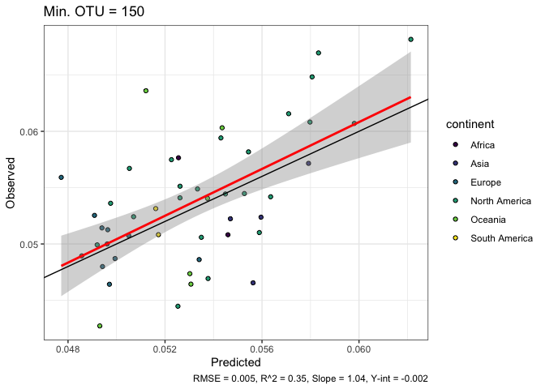
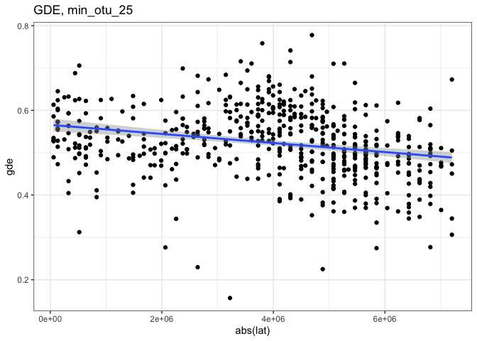

Modeling
================

## Load packages

``` r
# for path management
library(here)
# for raster data
library(raster)
# to speed up rasterization
library(fasterize)
# for data manipulation
library(tidyverse)
# for spatial operations
library(sf)
# for basemaps
library(rnaturalearth)
# for assessing SAC
library(spdep)
# for bayesian linear model
library(rstanarm)
# for spatial glmm
library(glmmfields)
# for model selection (projective predictive inference)
library(projpred)
# for spatial CV
library(spatialsample)
# for easy exploratory plots
library(bayesplot)
# for easy working with posteriors
library(tidybayes)
# for modeling workflow
library(tidymodels)
# for stitching together model output plots
library(patchwork)
# for spatial t-tests of differences in GDE/GDM across the global freezeline
library(SpatialPack) 


source(here("R", "modeling_fns.R"))

# setting the crs for maps and environmental data
# behrmann projection
crs_behr <- "+proj=cea +lon_0=0 +lat_ts=30 +x_0=0 +y_0=0 +datum=WGS84 +ellps=WGS84 +units=m +no_defs"

col_gdm <- "#366DA0FF"
col_gde <- "#B91657FF"
```

## Read in and process raw data

### Read raw data

``` r
# reading in the raw pairwise distances, just in case I need that info later
# I already created per-cell summaries, which I'm reading in below
raw_pi <- read_csv(here("output", "spreadsheets", "cell_medium_3_10_pi.csv"))

# only keeping relevant columns
raw_df <- read_csv(here("output", "spreadsheets", "cell_medium_3_10_sumstats.csv")) |> 
  select(cell, gdm = sqrt_pi, gde = hill_1, num_ind, num_otu, num_order)
```

### Add in spatial and environmental metadata

This includes converting the data frames to `sf` objects to make spatial
operations and plotting easier, mapping cells to their continents, and
extracting relevant environmental data.

``` r
# for assigning cells to continents. Islands are missed at coarser resolutions
world_large <- rnaturalearth::ne_countries(scale = "large", returnclass = "sf") |>
  select(continent, name_long) |> 
  st_transform(crs = crs_behr) 

# for mapping. this will be smaller so plotting is faster
world_small <- rnaturalearth::ne_countries(scale = "small", returnclass = "sf") |>
  select(continent, name_long) |> 
  st_transform(crs = crs_behr) 

# all predictors
predictors_all <- c("current_medium_bio_13", 
                    "current_medium_bio_14", 
                    "current_medium_bio_15", 
                    "current_medium_bio_2", 
                    "current_medium_bio_5", 
                    "ghh_medium_std_dev", 
                    "human_medium_gHM", 
                    "GlobalExtreme_tsTrendExt", 
                    "GlobalExtreme_tsVarExt", 
                    "GlobalExtreme_prTrendExt", 
                    "GlobalExtreme_prVarExt")

# Read in predictor rasters
rast_list <- list.files(here("data", "climate_agg"),
                        pattern = "medium",
                        full.names = TRUE) 


rast_list_pred <- rast_list[str_detect(rast_list,  paste(predictors_all, collapse = "|"))]


rasters_full <- raster::stack(rast_list_pred)

crs(rasters_full) <- crs_behr

# convert to data frame 
predictors_sf <- rasters_full |>
  rasterToPolygons() |>
  st_as_sf() 

predictors_sf <- predictors_sf |> 
  mutate(cell = cellFromXY(rasters_full, st_coordinates(st_centroid(predictors_sf)))) |> 
  rename_with(~str_remove_all(.x, "current_medium_"), contains("current_medium")) |> rename_with(~str_remove_all(.x, "medium_"), contains("_medium_"))

# read in stability 
stability_sf <- read_sf(here("data", "climate_poly", "new_stability.geojson"), crs = crs_behr) |> 
  rename(precip_trend = GlobalExtreme_prTrendExt,
         precip_var = GlobalExtreme_prVarExt,
         temp_trend = GlobalExtreme_tsTrendExt,
         temp_var = GlobalExtreme_tsVarExt)

# for freezeline delineation
div_sf <- st_read(here("data", "climate_poly", "min_temp_binary.geojson")) |> 
  st_transform(crs = crs_behr)
```

    Reading layer `min_temp_binary' from data source 
      `/Users/connorfrench/Dropbox/Old_Mac/School_Stuff/CUNY/BigAss-bird-phylogeography/BigAss-phylogeography/data/climate_poly/min_temp_binary.geojson' 
      using driver `GeoJSON'
    Simple feature collection with 2 features and 1 field
    Geometry type: MULTIPOLYGON
    Dimension:     XY
    Bounding box:  xmin: -180.0001 ymin: -88.29181 xmax: 179.6665 ymax: 83.66653
    Geodetic CRS:  WGS 84

``` r
# hack to validate the multipolygon
div_sf_buf <- st_buffer(div_sf, dist = 0)
```

``` r
# add predictors and continents 
full_sf <- left_join(predictors_sf, raw_df, by = "cell") |> 
  st_join(stability_sf, left = TRUE, largest = TRUE) |> 
  st_join(world_large, largest = TRUE) |> 
  st_join(div_sf_buf, largest = TRUE) |> 
  mutate(freezeline = if_else(min_temp == "temperate", 1L, 0L))
  
ggplot() +
  geom_sf(data = world_small) +
  geom_sf(data = full_sf, aes(geometry = geometry, fill = gde, color = gde)) +
  scale_fill_viridis_c(na.value = "transparent") +
  scale_color_viridis_c(na.value = "transparent") +
  theme_bw()
```

``` r
write_sf(full_sf, here("output", "spreadsheets", "full_sf.geojson"))
```


### Create data sets with minimum OTU thresholds

10, 25, 50, 100, 150, 200

``` r
min_otu_vals <- c(10, 25, 50, 100, 150, 200)

splits_sf <- map(min_otu_vals, ~filter(full_sf, num_otu >= .x, 
                                       # there's a single missing value
                                       !is.na(ghh_std_dev)))

# there is a single cell in South America that doesn't map to the continent across all data sets
splits_sf <- map(splits_sf, ~mutate(.x, continent = replace_na(continent, "South America")))

# name the data frames
names(splits_sf) <- paste0("min_otu_", min_otu_vals)
```

### Split into testing and training data

Stratify the split according to continent to ensure somewhat even
spatial representation of the test vs training data. I’m doing a 75%
train to 25% test split. The test data will not be touched until the
end- this is not a train-validate split.

``` r
set.seed(9999)
initial_split_sf <- map(splits_sf, ~initial_split(data = .x, prop = 3/4, strata = continent))

train_sf <- map(initial_split_sf, training)

test_sf <- map(initial_split_sf, testing)
```

## GLMMFields

### Projection predictive variable selection

Need to scale the data before modeling (mean 0, sd 1). When predicting
to test data, I will apply the centering and scaling factors of the
training data to the test data to prevent data leakage.

``` r
train_scaled <- suppressWarnings(map(train_sf, scale_data))
```

Fit full models (all 11 predictors) as the reference models for projpred
selection.

``` r
options(mc.cores = parallel::detectCores())
set.seed(1977)
full_mod_gde <- map(train_scaled, ~run_stan(response = "gde", df = .x))

set.seed(137777)
full_mod_gdm <- map(train_scaled, ~run_stan(response = "gdm", df = .x))
```

``` r
write_rds(full_mod_gde, here("output", "models", "full_mod_gde.rds"))

write_rds(full_mod_gdm, here("output", "models", "full_mod_gdm.rds"))
```

Do projection predictive selection. After visually inspecting the
performance statistics plots (ELPD and RMSE; example plot below), I
determined that the model size suggested by `projpred::suggest_size()`
was the most reasonable model size for all OTU filtering schemes.

``` r
projpred_gde <- map(full_mod_gde, run_projpred)

projpred_gdm <- map(full_mod_gdm, run_projpred)


plot(projpred_gde$min_otu_100, stats = c("elpd", "rmse"), deltas = TRUE)
plot(projpred_gdm$min_otu_100, stats = c("elpd", "rmse"), deltas = TRUE)
```

``` r
write_rds(projpred_gde, here("output", "models", "projpred_gde.rds"))
write_rds(projpred_gdm, here("output", "models", "projpred_gdm.rds"))
```


### GLMM models

Run the models.

``` r
options(mc.cores = parallel::detectCores())

set.seed(895)
glmm_gde <- map2(train_scaled, projpred_gde, ~run_glmmfields(response = "gde", df = .x, pp = .y))

set.seed(8985)
glmm_gdm <- map2(train_scaled, projpred_gdm, ~run_glmmfields(response = "gdm", df = .x, pp = .y, nknots = 30))
```

``` r
write_rds(glmm_gde, here("output", "models", "glmm_gde.rds"))
write_rds(glmm_gdm, here("output", "models", "glmm_gdm.rds"))
```

### Compare models

Comparing the top models selected from the two model selection
approaches. I’m going to compare the variables that are selected, the
levels of residual spatial autocorrelation (SAC), and the spatial
distribution of error in the training set.

#### Residual SAC

The GLMM properly accounts for SAC in both data sets!

``` r
# predictions
glmm_pred_gde <- map(glmm_gde, predict)
glmm_pred_gdm <- map(glmm_gdm, predict)
```

``` r
write_rds(glmm_pred_gde, here("output", "spreadsheets", "glmm_pred_gde.rds"))
write_rds(glmm_pred_gdm, here("output", "spreadsheets", "glmm_pred_gdm.rds"))
```

``` r
# map to sf data frames for spatial weights matrices and doing moran.mc easily
glmm_pred_sf_gde <- map2(train_sf, glmm_pred_gde, ~mutate(.x, .pred = pull(.y, 1), .resid = gde - .pred))
glmm_pred_sf_gdm <- map2(train_sf, glmm_pred_gdm, ~mutate(.x, .pred = pull(.y, 1), .resid = gdm - .pred))

# create a neighborhood matrix (queen = TRUE means all neighbors, including diagonals, will be included) and spatial weights matrix
glmm_w <- map(train_sf, ~poly2nb(.x, queen = TRUE)) |> 
  map(~nb2listw(.x, style = "W", zero.policy = TRUE))


glmm_moran_gde <- map2(glmm_pred_sf_gde, glmm_w, ~moran.mc(.x$.resid, .y, nsim = 10000, zero.policy = TRUE))
glmm_moran_gdm <- map2(glmm_pred_sf_gdm, glmm_w, ~moran.mc(.x$.resid, .y, nsim = 10000, zero.policy = TRUE))

# check moran p-values
map(glmm_moran_gde, ~.x[["p.value"]]) |> 
  bind_rows() |> 
  knitr::kable(caption = "Moran's I p-values (GDE)")
```

| min_otu_10 | min_otu_25 | min_otu_50 | min_otu_100 | min_otu_150 | min_otu_200 |
|-----------:|-----------:|-----------:|------------:|------------:|------------:|
|  0.2127787 |  0.1192881 |  0.1878812 |   0.7075292 |   0.4193581 |   0.5543446 |

Moran’s I p-values (GDE)

``` r
map(glmm_moran_gdm, ~.x[["p.value"]]) |> 
  bind_rows() |> 
  knitr::kable(caption = "Moran's I p-values (GDM)")
```

| min_otu_10 | min_otu_25 | min_otu_50 | min_otu_100 | min_otu_150 | min_otu_200 |
|-----------:|-----------:|-----------:|------------:|------------:|------------:|
|  0.3030697 |  0.1594841 |  0.1461854 |   0.7384262 |   0.4887511 |   0.2788721 |

Moran’s I p-values (GDM)

#### Bayes R^2

``` r
r2_df_gde <- tibble(
  r2_curr_clim =  bayes_R2_glmmfields(glmm_gde$min_otu_100)[,1]
) |> 
  pivot_longer(cols = everything(),
               names_to = "model",
               values_to = "post")

r2_df_gdm <- tibble(
  r2_curr_clim =  bayes_R2_glmmfields(glmm_gdm$min_otu_100)[,1]
) |> 
  pivot_longer(cols = everything(),
               names_to = "model",
               values_to = "post")

ggplot() +
  geom_density(data = r2_df_gde, aes(x = post), color = col_gde) +
  geom_density(data = r2_df_gdm, aes(x = post), color = col_gdm) +
  labs(title = paste0("Median GDE = ", round(median(r2_df_gde$post), 3), "\n", "Median GDM = ", round(median(r2_df_gdm$post), 3)))
```


#### Posterior plots

Generating a bunch of diagnostic plots to compare how the models perform
on training data.

##### Get posteriors

``` r
posts_gde <- map(glmm_gde, ~glmmfields::posterior_predict(.x, iter = 1000))
posts_gdm <- map(glmm_gdm, ~glmmfields::posterior_predict(.x, iter = 1000))

resp_gde <- map(train_sf, ~pull(.x, gde))
resp_gdm <- map(train_sf, ~pull(.x, gdm))
```

##### Posterior-predictive check

The posteriors for all are similar, but the distribution of GDE gets
narrower as the minimum OTU filter increases.

``` r
plot_ppc_dens <- function(resp, post, xlims = c(0, 1)) {
  
  ppc_dens_overlay(resp, post[1:50,]) +
    lims(x = xlims)
}

ppc_gde <-
  map2(
    resp_gde,
    posts_gde,
    ~ plot_ppc_dens(.x, .y)
  )

ppc_gdm <-
  map2(
    resp_gdm,
    posts_gdm,
    ~ plot_ppc_dens(.x, .y, xlims = c(0, 0.1))
  )
```

<div class="panel-tabset">

###### PPC GDE

``` r
ppc_gde[["min_otu_10"]] + labs(title = "min_otu_10") +
  ppc_gde[["min_otu_25"]] + labs(title = "min_otu_25") +
  ppc_gde[["min_otu_50"]] + labs(title = "min_otu_50") +
  ppc_gde[["min_otu_100"]] + labs(title = "min_otu_100") +
  ppc_gde[["min_otu_150"]] + labs(title = "min_otu_150") +
  ppc_gde[["min_otu_200"]] + labs(title = "min_otu_200") +
  patchwork::plot_layout(ncol = 2) 
```


###### PPC GDM

``` r
ppc_gdm[["min_otu_10"]] + labs(title = "min_otu_10") +
  ppc_gdm[["min_otu_25"]] + labs(title = "min_otu_25") +
  ppc_gdm[["min_otu_50"]] + labs(title = "min_otu_50") +
  ppc_gdm[["min_otu_100"]] + labs(title = "min_otu_100") +
  ppc_gdm[["min_otu_150"]] + labs(title = "min_otu_150") +
  ppc_gdm[["min_otu_200"]] + labs(title = "min_otu_200") +
  patchwork::plot_layout(ncol = 2) 
```

    Warning: Removed 1 rows containing non-finite values (`stat_density()`).


</div>

##### Coefficient posteriors

For GDE:  
BIO5 (max temp of the warmest month) shows up in all models, followed by
BIO13 (prec of wettest month, 4/6), temp_var (4/6), temp_trend (4/6),
BIO2 (diurnal temp range, 3/6)

For GDM:

``` r
# only include post-warmup draws
beta_posts_gde <- map(glmm_gde, get_beta_posts) 
beta_posts_gdm <- map(glmm_gdm, get_beta_posts) 

beta_plots_gde <- map(beta_posts_gde, ~mcmc_intervals(.x, 
           prob = 0.90,
           prob_outer = 0.95) +
  geom_vline(xintercept = 0) +
  ggtitle("90% and 95% CI intervals"))  

beta_plots_gdm <- map(beta_posts_gdm, ~mcmc_intervals(.x, 
           prob = 0.90,
           prob_outer = 0.95) +
  geom_vline(xintercept = 0) +
  ggtitle("90% and 95% CI intervals"))  
```

<div class="panel-tabset">

###### Beta GDE

``` r
beta_plots_gde[["min_otu_10"]] + labs(title = "min_otu_10") +
  beta_plots_gde[["min_otu_25"]] + labs(title = "min_otu_25") +
  beta_plots_gde[["min_otu_50"]] + labs(title = "min_otu_50") +
  beta_plots_gde[["min_otu_100"]] + labs(title = "min_otu_100") +
  beta_plots_gde[["min_otu_150"]] + labs(title = "min_otu_150") +
  beta_plots_gde[["min_otu_200"]] + labs(title = "min_otu_200") +
  patchwork::plot_layout(ncol = 2) 
```


###### Beta GDM

``` r
beta_plots_gdm[["min_otu_10"]] + labs(title = "min_otu_10") +
  beta_plots_gdm[["min_otu_25"]] + labs(title = "min_otu_25") +
  beta_plots_gdm[["min_otu_50"]] + labs(title = "min_otu_50") +
  beta_plots_gdm[["min_otu_100"]] + labs(title = "min_otu_100") +
  beta_plots_gdm[["min_otu_150"]] + labs(title = "min_otu_150") +
  beta_plots_gdm[["min_otu_200"]] + labs(title = "min_otu_200") +
  patchwork::plot_layout(ncol = 2) 
```

    Warning: Removed 1 rows containing missing values (`geom_vline()`).


</div>

### Test predictions

Predicting the model to withheld test data.

``` r
test_scaled <- suppressWarnings(map2(train_sf, test_sf, ~scale_test(.x, .y)))
set.seed(38888)
test_pred_gde <- map2(glmm_gde, test_scaled, ~predict(.x, newdata = .y))
test_pred_gdm <- map2(glmm_gdm, test_scaled, ~predict(.x, newdata = .y))

test_sf_gde <-
  map2(
    test_sf,
    test_pred_gde,
    ~ mutate(
      .x,
      .pred = .y$estimate,
      .pred_ci = .y$conf_high - .y$conf_low,
      .resid = gde - .y$estimate
    )
  )

test_sf_gdm <-
  map2(
    test_sf,
    test_pred_gdm,
    ~ mutate(
      .x,
      .pred = .y$estimate,
      .pred_ci = .y$conf_high - .y$conf_low,
      .resid = gdm - .y$estimate
    )
  )
```

``` r
write_rds(test_sf_gdm, here("output", "spreadsheets", "test_sf_gdm.rds"))
write_rds(test_sf_gde, here("output", "spreadsheets", "test_sf_gde.rds"))
```

<div class="panel-tabset">

#### Obs-v-pred GDE

``` r
obs_vs_pred_gde <- map(test_sf_gde, ~plot_obs_vs_pred(.x, resp = "gde"))

obs_vs_pred_gde[["min_otu_10"]] + labs(title = "Min. OTU = 10") 
```


``` r
  obs_vs_pred_gde[["min_otu_25"]] + labs(title = "Min. OTU = 25") 
```


``` r
  obs_vs_pred_gde[["min_otu_50"]] + labs(title = "Min. OTU = 50") 
```


``` r
  obs_vs_pred_gde[["min_otu_100"]] + labs(title = "Min. OTU = 100") 
```


``` r
  obs_vs_pred_gde[["min_otu_150"]] + labs(title = "Min. OTU = 150") 
```


``` r
  obs_vs_pred_gde[["min_otu_200"]] + labs(title = "Min. OTU = 200") 
```


``` r
write_rds(obs_vs_pred_gde, here("output", "exploratory_plots", "obs_vs_pred_gde.rds"))
```

#### Obs-v-pred GDM

``` r
obs_vs_pred_gdm <- map(test_sf_gdm, ~plot_obs_vs_pred(.x, resp = "gdm"))

obs_vs_pred_gdm[["min_otu_10"]] + labs(title = "Min. OTU = 10") 
```


``` r
  obs_vs_pred_gdm[["min_otu_25"]] + labs(title = "Min. OTU = 25") 
```


``` r
  obs_vs_pred_gdm[["min_otu_50"]] + labs(title = "Min. OTU = 50") 
```


``` r
  obs_vs_pred_gdm[["min_otu_100"]] + labs(title = "Min. OTU = 100") 
```


``` r
  obs_vs_pred_gdm[["min_otu_150"]] + labs(title = "Min. OTU = 150") 
```



``` r
  obs_vs_pred_gdm[["min_otu_200"]] + labs(title = "Min. OTU = 200") 
```


``` r
write_rds(obs_vs_pred_gdm, here("output", "exploratory_plots", "obs_vs_pred_gdm.rds"))
```

</div>

#### Test maps

``` r
test_pred_maps_gde <- map(test_sf_gde, ~map_test(.x, var = ".pred"))
test_pred_maps_gdm <- map(test_sf_gdm, ~map_test(.x, var = ".pred"))
```

<div class="panel-tabset">

##### Test-pred-10

``` r
test_pred_maps_gde[["min_otu_10"]] + labs(title = "GDE, min_otu_10")
```


``` r
test_pred_maps_gdm[["min_otu_10"]] + labs(title = "GDM, min_otu_10")
```


##### Test-pred-25

``` r
test_pred_maps_gde[["min_otu_25"]] + labs(title = "GDE, min_otu_25")
```


``` r
test_pred_maps_gdm[["min_otu_25"]] + labs(title = "GDM, min_otu_25")
```


##### Test-pred-50

``` r
test_pred_maps_gde[["min_otu_50"]] + labs(title = "GDE, min_otu_50")
```


``` r
test_pred_maps_gdm[["min_otu_50"]] + labs(title = "GDM, min_otu_50")
```


##### Test-pred-100

``` r
test_pred_maps_gde[["min_otu_100"]] + labs(title = "GDE, min_otu_100")
```


``` r
test_pred_maps_gdm[["min_otu_100"]] + labs(title = "GDM, min_otu_100")
```


##### Test-pred-150

``` r
test_pred_maps_gde[["min_otu_150"]] + labs(title = "GDE, min_otu_150")
```


``` r
test_pred_maps_gdm[["min_otu_150"]] + labs(title = "GDM, min_otu_150")
```


##### Test-pred-200

``` r
test_pred_maps_gde[["min_otu_200"]] + labs(title = "GDE, min_otu_200")
```


``` r
test_pred_maps_gdm[["min_otu_200"]] + labs(title = "GDM, min_otu_200")
```


</div>

#### Test residual maps

Maps of residual error across test data.

``` r
test_resid_maps_gde <- map(test_sf_gde, ~map_test(.x, var = ".resid"))

test_resid_maps_gdm <- map(test_sf_gdm, ~map_test(.x, var = ".resid"))
```

<div class="panel-tabset">

##### Test-resid-map-10

``` r
test_resid_maps_gde[["min_otu_10"]] + labs(title = "GDE, min_otu_10")
```


``` r
test_resid_maps_gdm[["min_otu_10"]] + labs(title = "GDM, min_otu_10")
```


##### Test-resid-map-25

``` r
test_resid_maps_gde[["min_otu_25"]] + labs(title = "GDE, min_otu_25")
```


``` r
test_resid_maps_gdm[["min_otu_25"]] + labs(title = "GDM, min_otu_25")
```


##### Test-resid-map-50

``` r
test_resid_maps_gde[["min_otu_50"]] + labs(title = "GDE, min_otu_50")
```


``` r
test_resid_maps_gdm[["min_otu_50"]] + labs(title = "GDM, min_otu_50")
```


##### Test-resid-map-100

``` r
test_resid_maps_gde[["min_otu_100"]] + labs(title = "GDE, min_otu_100")
```


``` r
test_resid_maps_gdm[["min_otu_100"]] + labs(title = "GDM, min_otu_100")
```


##### Test-resid-map-150

``` r
test_resid_maps_gde[["min_otu_150"]] + labs(title = "GDE, min_otu_150")
```


``` r
test_resid_maps_gdm[["min_otu_150"]] + labs(title = "GDM, min_otu_150")
```


##### Test-resid-map-200

``` r
test_resid_maps_gde[["min_otu_200"]] + labs(title = "GDE, min_otu_200")
```


``` r
test_resid_maps_gdm[["min_otu_200"]] + labs(title = "GDM, min_otu_200")
```


</div>

#### Test 95% CI maps

Maps of the range in 95% CI of predicted values.

``` r
test_ci_maps_gde <- map(test_sf_gde, ~map_test(.x, var = ".pred_ci"))
test_ci_maps_gdm <- map(test_sf_gdm, ~map_test(.x, var = ".pred_ci"))
```

<div class="panel-tabset">

##### Test-CI-map-10

``` r
test_ci_maps_gde[["min_otu_10"]] + labs(title = "GDE, min_otu_10")
```


``` r
test_ci_maps_gdm[["min_otu_10"]] + labs(title = "GDM, min_otu_10")
```


##### Test-CI-map-25

``` r
test_ci_maps_gde[["min_otu_25"]] + labs(title = "GDE, min_otu_25") 
```


``` r
test_ci_maps_gdm[["min_otu_25"]] + labs(title = "GDM, min_otu_25") 
```


##### Test-CI-map-50

``` r
test_ci_maps_gde[["min_otu_50"]] + labs(title = "GDE, min_otu_50")
```


``` r
test_ci_maps_gdm[["min_otu_50"]] + labs(title = "GDM, min_otu_50")
```


##### Test-CI-map-100

``` r
test_ci_maps_gde[["min_otu_100"]] + labs(title = "GDE, min_otu_100") 
```


``` r
test_ci_maps_gdm[["min_otu_100"]] + labs(title = "GDM, min_otu_100") 
```


##### Test-CI-map-150

``` r
test_ci_maps_gde[["min_otu_150"]] + labs(title = "GDE, min_otu_150") 
```


``` r
test_ci_maps_gdm[["min_otu_150"]] + labs(title = "GDM, min_otu_150") 
```


##### Test-CI-map-200

``` r
test_ci_maps_gde[["min_otu_200"]] + labs(title = "GDE, min_otu_200") 
```


``` r
test_ci_maps_gdm[["min_otu_200"]] + labs(title = "GDM, min_otu_200") 
```


</div>

### Full maps

Predicting the models to the full data sets

``` r
pred_vars <- c("bio_2", 
                 "bio_5", 
                 "bio_13", 
                 "bio_14", 
                 "bio_15", 
                 "ghh_std_dev", 
                 "human_gHM", 
                 "precip_trend", 
                 "precip_var",
                 "temp_trend",
                 "temp_var")


full_scaled <- suppressWarnings(map(train_sf, ~scale_test(.x, df_test = full_sf)))

full_scaled_noNA <- map(full_scaled, ~filter(.x, complete.cases(across(any_of(pred_vars)))))

full_preds_gde <- map2(glmm_gde, full_scaled_noNA, ~predict(.x, .y))
full_preds_gdm <- map2(glmm_gdm, full_scaled_noNA, ~predict(.x, .y))

full_sf_noNA <- filter(full_sf, complete.cases(across(any_of(pred_vars)))) 


full_preds_sf_gde <-
  map(full_preds_gde, ~ bind_cols(full_sf_noNA, .x)) |>
  map( ~ mutate(
    .x,
    .pred = estimate,
    .pred_ci = conf_high - conf_low,
    .resid = gde - .pred,
    # there are some outlier localities that really skew the distribution of error
    .log_ci = log(.pred_ci)
  ))

full_preds_sf_gdm <-
  map(full_preds_gdm, ~ bind_cols(full_sf_noNA, .x)) |>
  map( ~ mutate(
    .x,
    .pred = estimate,
    .pred_ci = conf_high - conf_low,
    .resid = gdm - .pred,
    # there are some outlier localities that really skew the distribution of error
    .log_ci = log(.pred_ci)
  ))
```

Write the predictions to file because they take forever to generate

``` r
write_rds(full_preds_gde, here("output", "spreadsheets", "full_preds_gde.rds"))
write_rds(full_preds_gdm, here("output", "spreadsheets", "full_preds_gdm.rds"))

write_rds(full_preds_sf_gde, here("output", "spreadsheets", "full_preds_sf_gde.rds"))
write_rds(full_preds_sf_gdm, here("output", "spreadsheets", "full_preds_sf_gdm.rds"))
```

#### Full prediction maps

Make the prediction maps.

``` r
full_pred_maps_gde <- map(full_preds_sf_gde, ~map_test(.x, var = ".pred"))
full_pred_maps_gdm <- map(full_preds_sf_gdm, ~map_test(.x, var = ".pred"))
```

<div class="panel-tabset">

##### Full-pred-map-10

``` r
full_pred_maps_gde[["min_otu_10"]] + labs(title = "GDE, min_otu_10")
```


``` r
full_pred_maps_gdm[["min_otu_10"]] + labs(title = "GDM, min_otu_10")
```


##### Full-pred-map-25

``` r
full_pred_maps_gde[["min_otu_25"]] + labs(title = "GDE, min_otu_25")
```


``` r
full_pred_maps_gdm[["min_otu_25"]] + labs(title = "GDM, min_otu_25")
```


##### Full-pred-map-50

``` r
full_pred_maps_gde[["min_otu_50"]] + labs(title = "GDE, min_otu_50")
```


``` r
full_pred_maps_gdm[["min_otu_50"]] + labs(title = "GDM, min_otu_50")
```


##### Full-pred-map-100

``` r
full_pred_maps_gde[["min_otu_100"]] + labs(title = "GDE, min_otu_100")
```


``` r
full_pred_maps_gdm[["min_otu_100"]] + labs(title = "GDM, min_otu_100")
```


##### Full-pred-map-150

``` r
full_pred_maps_gde[["min_otu_150"]] + labs(title = "GDE, min_otu_150")
```


``` r
full_pred_maps_gdm[["min_otu_150"]] + labs(title = "GDM, min_otu_150")
```


##### Full-pred-map-200

``` r
full_pred_maps_gde[["min_otu_200"]] + labs(title = "GDE, min_otu_200")
```


``` r
full_pred_maps_gdm[["min_otu_200"]] + labs(title = "GDM, min_otu_200")
```


</div>

#### Full 95% CI maps

Make the CI error maps.

``` r
full_ci_maps_gde <- map(full_preds_sf_gde, ~map_test(.x, var = ".log_ci"))
full_ci_maps_gdm <- map(full_preds_sf_gdm, ~map_test(.x, var = ".log_ci"))
```

<div class="panel-tabset">

##### Full-CI-maps-10

``` r
full_ci_maps_gde[["min_otu_10"]] + labs(title = "GDE, min_otu_10")
```


``` r
full_ci_maps_gdm[["min_otu_10"]] + labs(title = "GDM, min_otu_10")
```


##### Full-CI-maps-25

``` r
full_ci_maps_gde[["min_otu_25"]] + labs(title = "GDE, min_otu_25")
```


``` r
full_ci_maps_gdm[["min_otu_25"]] + labs(title = "GDM, min_otu_25")
```


##### Full-CI-maps-50

``` r
full_ci_maps_gde[["min_otu_50"]] + labs(title = "GDE, min_otu_50")
```


``` r
full_ci_maps_gdm[["min_otu_50"]] + labs(title = "GDM, min_otu_50")
```


##### Full-CI-maps-100

``` r
full_ci_maps_gde[["min_otu_100"]] + labs(title = "GDE, min_otu_100")
```


``` r
full_ci_maps_gdm[["min_otu_100"]] + labs(title = "GDM, min_otu_100")
```


##### Full-CI-maps-150

``` r
full_ci_maps_gde[["min_otu_150"]] + labs(title = "GDE, min_otu_150")
```


``` r
full_ci_maps_gdm[["min_otu_150"]] + labs(title = "GDM, min_otu_150")
```


##### Full-CI-maps-200

``` r
full_ci_maps_gde[["min_otu_200"]] + labs(title = "GDE, min_otu_200")
```


``` r
full_ci_maps_gdm[["min_otu_200"]] + labs(title = "GDM, min_otu_200")
```


</div>

## Latitude

I opted for a simple assessment of latitude \~ GD, by doing a pearson
correlation that accounts for spatial autocorrelation. I tested for a
linear and quadratic relationship, as there appears to be a mid-latitude
hump in GD.

``` r
coords_full <- map(splits_sf, ~st_coordinates(st_centroid(.x)))

sp_lat_gde <- map2(splits_sf, coords_full, ~modified.ttest(x = abs(.y[,2]), y = .x$gde, coords = .y))

sp_lat_gdm <- map2(splits_sf, coords_full, ~modified.ttest(x = abs(.y[,2]^2), y = .x$gdm, coords = .y))

sp_lat_quad_gde <- map2(splits_sf, coords_full, ~modified.ttest(x = abs(.y[,2]^2), y = .x$gde, coords = .y))

sp_lat_quad_gdm <- map2(splits_sf, coords_full, ~modified.ttest(x = abs(.y[,2]), y = .x$gdm, coords = .y))

map(sp_lat_gde, ~.x[["p.value"]]) |> 
  bind_rows() |> 
  knitr::kable(caption = "Latitude p-values (GDE)")

map(sp_lat_gde, ~.x[["corr"]]) |> 
  bind_rows() |> 
  knitr::kable(caption = "Latitude correlation coefficients (GDE)")

map(sp_lat_gdm, ~.x[["p.value"]]) |> 
  bind_rows() |> 
  knitr::kable(caption = "Latitude p-values (GDM)")

map(sp_lat_gdm, ~.x[["corr"]]) |> 
  bind_rows() |> 
  knitr::kable(caption = "Latitude correlation coefficients (GDM)")

map(sp_lat_quad_gde, ~.x[["p.value"]]) |> 
  bind_rows() |> 
  knitr::kable(caption = "Latitude p-values (GDE quad)")

map(sp_lat_quad_gde, ~.x[["corr"]]) |> 
  bind_rows() |> 
  knitr::kable(caption = "Latitude correlation coefficients (GDE quad)")

map(sp_lat_quad_gdm, ~.x[["p.value"]]) |> 
  bind_rows() |> 
  knitr::kable(caption = "Latitude p-values (GDM quad)")

map(sp_lat_quad_gdm, ~.x[["corr"]]) |> 
  bind_rows() |> 
  knitr::kable(caption = "Latitude correlation coefficients (GDM quad)")
```

| min_otu_10 | min_otu_25 | min_otu_50 | min_otu_100 | min_otu_150 | min_otu_200 |
|-----------:|-----------:|-----------:|------------:|------------:|------------:|
|  0.1218372 |  0.0328494 |  0.0824729 |   0.0639672 |   0.0517265 |   0.0471147 |

Latitude p-values (GDE)

| min_otu_10 | min_otu_25 | min_otu_50 | min_otu_100 | min_otu_150 | min_otu_200 |
|-----------:|-----------:|-----------:|------------:|------------:|------------:|
| -0.1335496 | -0.2450824 | -0.2498223 |   -0.279874 |  -0.3447724 |  -0.3555856 |

Latitude correlation coefficients (GDE)

| min_otu_10 | min_otu_25 | min_otu_50 | min_otu_100 | min_otu_150 | min_otu_200 |
|-----------:|-----------:|-----------:|------------:|------------:|------------:|
|  0.8285219 |  0.9184679 |  0.8408779 |    0.766976 |   0.9010953 |   0.9615755 |

Latitude p-values (GDM)

| min_otu_10 | min_otu_25 | min_otu_50 | min_otu_100 | min_otu_150 | min_otu_200 |
|-----------:|-----------:|-----------:|------------:|------------:|------------:|
|  0.0181651 |  0.0122095 |  0.0327533 |   0.0527753 |  -0.0228155 |  -0.0092474 |

Latitude correlation coefficients (GDM)

``` r
lat_df <- map(splits_sf, function(x) {
  c <- st_coordinates(st_centroid(x))
  df <- mutate(x, lat = c[,2], lon = c[,1])
  return(df)
})
```

    Warning in st_centroid.sf(x): st_centroid assumes attributes are constant over
    geometries of x

    Warning in st_centroid.sf(x): st_centroid assumes attributes are constant over
    geometries of x

    Warning in st_centroid.sf(x): st_centroid assumes attributes are constant over
    geometries of x

    Warning in st_centroid.sf(x): st_centroid assumes attributes are constant over
    geometries of x

    Warning in st_centroid.sf(x): st_centroid assumes attributes are constant over
    geometries of x

    Warning in st_centroid.sf(x): st_centroid assumes attributes are constant over
    geometries of x

``` r
lat_plots_gde <- map(lat_df, ~ggplot(data = .x, aes(x = abs(lat), y = gde)) + 
                       geom_point() + 
                       geom_smooth(method = "lm") + 
                       theme_bw())

lat_plots_gdm <- map(lat_df, ~ggplot(data = .x, aes(x = abs(lat), y = gdm)) + 
                       geom_point() + 
                       geom_smooth(method = "lm") + 
                       theme_bw())
```

``` r
lat_plots_gde[["min_otu_10"]] + labs(title = "GDE, min_otu_10") 
```

    `geom_smooth()` using formula = 'y ~ x'


``` r
  lat_plots_gde[["min_otu_25"]] + labs(title = "GDE, min_otu_25") 
```

    `geom_smooth()` using formula = 'y ~ x'



``` r
  lat_plots_gde[["min_otu_50"]] + labs(title = "GDE, min_otu_50") 
```

    `geom_smooth()` using formula = 'y ~ x'


``` r
  lat_plots_gde[["min_otu_100"]] + labs(title = "GDE, min_otu_100") 
```

    `geom_smooth()` using formula = 'y ~ x'


``` r
  lat_plots_gde[["min_otu_150"]] + labs(title = "GDE, min_otu_150") 
```

    `geom_smooth()` using formula = 'y ~ x'


``` r
  lat_plots_gde[["min_otu_200"]] + labs(title = "GDE, min_otu_200")
```

    `geom_smooth()` using formula = 'y ~ x'


``` r
lat_plots_gdm[["min_otu_10"]] + labs(title = "GDM, min_otu_10") 
```

    `geom_smooth()` using formula = 'y ~ x'


``` r
  lat_plots_gdm[["min_otu_25"]] + labs(title = "GDM, min_otu_25") 
```

    `geom_smooth()` using formula = 'y ~ x'


``` r
  lat_plots_gdm[["min_otu_50"]] + labs(title = "GDM, min_otu_50") 
```

    `geom_smooth()` using formula = 'y ~ x'


``` r
  lat_plots_gdm[["min_otu_100"]] + labs(title = "GDM, min_otu_100") 
```

    `geom_smooth()` using formula = 'y ~ x'


``` r
  lat_plots_gdm[["min_otu_150"]] + labs(title = "GDM, min_otu_150") 
```

    `geom_smooth()` using formula = 'y ~ x'


``` r
  lat_plots_gdm[["min_otu_200"]] + labs(title = "GDM, min_otu_200")
```

    `geom_smooth()` using formula = 'y ~ x'


## Freezeline

GDE is significantly different across the global freezeline for all
datasets, while GDM is not.

``` r
coords_full <- map(splits_sf, ~st_coordinates(st_centroid(.x)))

sp_ttest_gde <- map2(splits_sf, coords_full, ~modified.ttest(x = .x$freezeline, y = .x$gde, coords = .y))

sp_ttest_gdm <- map2(splits_sf, coords_full, ~modified.ttest(x = .x$freezeline, y = .x$gdm, coords = .y))

map(sp_ttest_gde, ~.x[["p.value"]]) |> 
  bind_rows() |> 
  knitr::kable(caption = "Freezeline p-values (GDE)")

map(sp_ttest_gde, ~.x[["corr"]]) |> 
  bind_rows() |> 
  knitr::kable(caption = "Freezeline correlation coefficients (GDE)")

map(sp_ttest_gdm, ~.x[["p.value"]]) |> 
  bind_rows() |> 
  knitr::kable(caption = "Freezeline p-values (GDM)")

map(sp_ttest_gdm, ~.x[["corr"]]) |> 
  bind_rows() |> 
  knitr::kable(caption = "Freezeline correlation coefficients (GDM)")
```

| min_otu_10 | min_otu_25 | min_otu_50 | min_otu_100 | min_otu_150 | min_otu_200 |
|-----------:|-----------:|-----------:|------------:|------------:|------------:|
|  0.0107783 |  0.0101762 |   0.017008 |   0.0130217 |   0.0296767 |   0.0408479 |

Freezeline p-values (GDE)

| min_otu_10 | min_otu_25 | min_otu_50 | min_otu_100 | min_otu_150 | min_otu_200 |
|-----------:|-----------:|-----------:|------------:|------------:|------------:|
| -0.2155514 | -0.2745981 | -0.3154334 |  -0.3380986 |  -0.3650885 |  -0.3452126 |

Freezeline correlation coefficients (GDE)

| min_otu_10 | min_otu_25 | min_otu_50 | min_otu_100 | min_otu_150 | min_otu_200 |
|-----------:|-----------:|-----------:|------------:|------------:|------------:|
|  0.8864441 |  0.8079055 |  0.8545842 |   0.4842055 |   0.7181578 |   0.5342123 |

Freezeline p-values (GDM)

| min_otu_10 | min_otu_25 | min_otu_50 | min_otu_100 | min_otu_150 | min_otu_200 |
|-----------:|-----------:|-----------:|------------:|------------:|------------:|
| -0.0100113 |  0.0230526 |  0.0233863 |   0.0966559 |   0.0536256 |   0.0952099 |

Freezeline correlation coefficients (GDM)

``` r
fl_boxplot_gde <- map(splits_sf, ~ggplot() + geom_boxplot(data = .x, aes(x = min_temp, y = gde)) + theme_bw())

fl_boxplot_gdm <- map(splits_sf, ~ggplot() + geom_boxplot(data = .x, aes(x = min_temp, y = gdm)) + theme_bw())
```

``` r
fl_boxplot_gde[["min_otu_10"]] + labs(title = "GDE, min_otu_10") 
```


``` r
  fl_boxplot_gde[["min_otu_25"]] + labs(title = "GDE, min_otu_25") 
```


``` r
  fl_boxplot_gde[["min_otu_50"]] + labs(title = "GDE, min_otu_50") 
```


``` r
  fl_boxplot_gde[["min_otu_100"]] + labs(title = "GDE, min_otu_100") 
```


``` r
  fl_boxplot_gde[["min_otu_150"]] + labs(title = "GDE, min_otu_150") 
```


``` r
  fl_boxplot_gde[["min_otu_200"]] + labs(title = "GDE, min_otu_200")
```


``` r
fl_boxplot_gdm[["min_otu_10"]] + labs(title = "GDM, min_otu_10") 
```


``` r
  fl_boxplot_gdm[["min_otu_25"]] + labs(title = "GDM, min_otu_25") 
```


``` r
  fl_boxplot_gdm[["min_otu_50"]] + labs(title = "GDM, min_otu_50") 
```


``` r
  fl_boxplot_gdm[["min_otu_100"]] + labs(title = "GDM, min_otu_100") 
```


``` r
  fl_boxplot_gdm[["min_otu_150"]] + labs(title = "GDM, min_otu_150") 
```


``` r
  fl_boxplot_gdm[["min_otu_200"]] + labs(title = "GDM, min_otu_200")
```


## MESS

``` r
world_base_map <- rnaturalearth::ne_countries(scale = "small", returnclass = "sf") |>
  select(continent, name_long) |> 
  st_transform(crs = "+proj=cea +lon_0=0 +lat_ts=30 +x_0=0 +y_0=0 +datum=WGS84 +ellps=WGS84 +units=m +no_defs") |> 
  filter(continent != "Antarctica",
         !is.na(continent))

# basemap for mapping. 
world_base_coast <- rnaturalearth::ne_coastline(scale = "large", returnclass = "sf") |> 
  st_transform(crs = "+proj=cea +lon_0=0 +lat_ts=30 +x_0=0 +y_0=0 +datum=WGS84 +ellps=WGS84 +units=m +no_defs") |> 
  st_join(world_base_map) |> 
  filter(continent != "Antarctica")
```

Multivariate Environmental Similarity Surfaces for all OTU
thresholds/models.

``` r
# get predictor set for each model
pred_vars_gde <- map(glmm_gde, get_beta_posts) |> 
  map(colnames) |> 
  map(~.x[str_detect(.x, "Dummy", negate = TRUE)])

pred_vars_gdm <- map(glmm_gdm, get_beta_posts) |> 
  map(colnames) |> 
  map(~.x[str_detect(.x, "Dummy", negate = TRUE)])

pred_vars <- unique(unlist(pred_vars_gde, pred_vars_gdm))

# get rasters and observed values for all thresholds
template_medium <- raster(here("data", "templates", "template_medium.tif"))

full_scaled <- suppressWarnings(map(train_sf, ~scale_test(.x, df_test = full_sf)))

full_scaled_noNA <- map(full_scaled, ~filter(.x, complete.cases(across(any_of(pred_vars)))))

full_scaled_noNA_sf <-
  map(full_scaled_noNA,
      ~ st_as_sf(.x, coords = c("lon", "lat"), crs = crs_behr) |>
        st_join(x = select(full_scaled_noNA, geometry)))


full_scaled_rasters_gde <- 
  map2(full_scaled_noNA_sf, pred_vars_gde, ~rasterize_preds(df = .x, rast_template = template_medium, pred_vars = .y))

full_scaled_rasters_gdm <- 
  map2(full_scaled_noNA_sf, pred_vars_gdm, ~rasterize_preds(df = .x, rast_template = template_medium, pred_vars = .y))


scaled_preds_gde <- map2(train_scaled, pred_vars_gde, ~select(.x, all_of(.y)) |> as.matrix())
scaled_preds_gdm <- map2(train_scaled, pred_vars_gdm, ~select(.x, all_of(.y)) |> as.matrix())
```

``` r
mess_gde <- map2(full_scaled_rasters_gde, scaled_preds_gde, dismo::mess) |> 
  map(mess_to_poly)

mess_gdm <- map2(full_scaled_rasters_gdm, scaled_preds_gdm, dismo::mess) |> 
  map(mess_to_poly)
```

``` r
write_rds(mess_gde, here("output", "models", "mess_gde.rds"))
write_rds(mess_gdm, here("output", "models", "mess_gdm.rds"))
```

### MESS Maps

``` r
mess_maps_gde <- map(mess_gde, map_mess)
mess_maps_gdm <- map(mess_gdm, map_mess)
```

#### MESS GDE

<div class="panel-tabset">

##### MESS-GDE-10

``` r
mess_maps_gde[["min_otu_10"]] + labs(title = "min_otu_10")
```


##### MESS-GDE-25

``` r
mess_maps_gde[["min_otu_25"]] + labs(title = "min_otu_25")
```


##### MESS-GDE-50

``` r
mess_maps_gde[["min_otu_50"]] + labs(title = "min_otu_50")
```


##### MESS-GDE-100

``` r
mess_maps_gde[["min_otu_100"]] + labs(title = "min_otu_100")
```


##### MESS-GDE-150

``` r
mess_maps_gde[["min_otu_150"]] + labs(title = "min_otu_150")
```


##### MESS-GDE-200

``` r
mess_maps_gde[["min_otu_200"]] + labs(title = "min_otu_200")
```


</div>

#### MESS GDM

<div class="panel-tabset">

##### MESS-GDM-10

``` r
mess_maps_gdm[["min_otu_10"]] + labs(title = "min_otu_10")
```


##### MESS-GDM-25

``` r
mess_maps_gdm[["min_otu_25"]] + labs(title = "min_otu_25")
```


##### MESS-GDM-50

``` r
mess_maps_gdm[["min_otu_50"]] + labs(title = "min_otu_50")
```


##### MESS-GDM-100

``` r
mess_maps_gdm[["min_otu_100"]] + labs(title = "min_otu_100")
```


##### MESS-GDM-150

``` r
mess_maps_gdm[["min_otu_150"]] + labs(title = "min_otu_150")
```


##### MESS-GDM-200

``` r
mess_maps_gdm[["min_otu_200"]] + labs(title = "min_otu_200")
```


</div>

## System information
