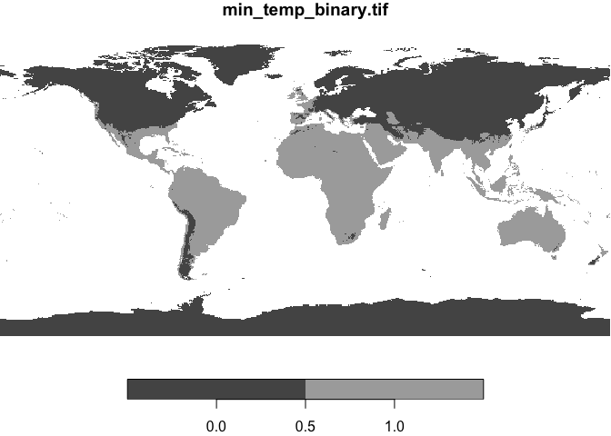
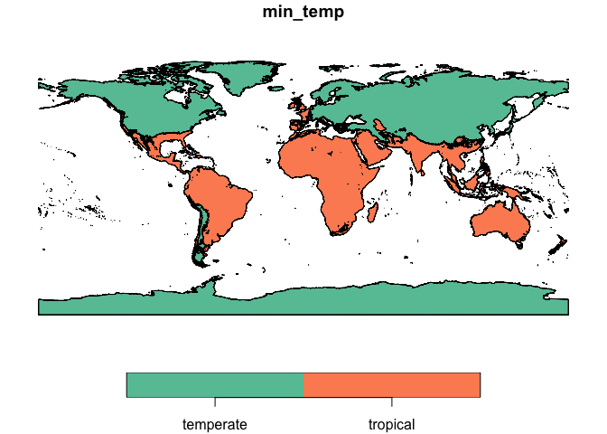

Temperate-Tropical Split
================
Connor French

I’m splitting the globe into a temperate-tropical divide based on: \>
White, A.E., Dey, K.K., Mohan, D., Stephens, M., Price, T.D., 2019.
Regional influences on community structure across the tropical-temperate
divide. Nat. Commun. 10, 2646.
<https://doi.org/10.1038/s41467-019-10253-6>.

They observe a sharp overturn in community composition along a “freeze
line”, where the minimum temperature of the coldest month is below zero
degrees. This corresponds roughly with temperate and tropical biomes. I
am using their delineation and further refining the distinction by
considering any “tropical” areas defined by the freeze line that overlap
with temperate biomes as temperate. The code for creating a binary
raster from the minimum temperature of the coldest month divide is in
the “step-0_aggregation.ipynb” script.

## Setup

``` r
library(tidyverse)
```

    ## ── Attaching packages ─────────────────────────────────────── tidyverse 1.3.2 ──
    ## ✔ ggplot2 3.4.0      ✔ purrr   0.3.4 
    ## ✔ tibble  3.1.8      ✔ dplyr   1.0.10
    ## ✔ tidyr   1.2.1      ✔ stringr 1.4.1 
    ## ✔ readr   2.1.3      ✔ forcats 0.5.2 
    ## ── Conflicts ────────────────────────────────────────── tidyverse_conflicts() ──
    ## ✖ dplyr::filter() masks stats::filter()
    ## ✖ dplyr::lag()    masks stats::lag()

``` r
library(stars)
```

    ## Loading required package: abind
    ## Loading required package: sf
    ## Linking to GEOS 3.11.0, GDAL 3.5.1, PROJ 9.0.1; sf_use_s2() is TRUE

``` r
library(sf)
library(here)
```

    ## here() starts at /Users/connorfrench/Dropbox/Old_Mac/School_Stuff/CUNY/BigAss-bird-phylogeography/BigAss-phylogeography

Read in the file and get a rough plot.

``` r
binary_raster <- read_stars(here("data", "climate_poly", "min_temp_binary.tif"))

plot(binary_raster)
```

    ## downsample set to 13

    ## Warning in st_is_longlat(x): bounding box has potentially an invalid value range
    ## for longlat data

    ## Warning in st_is_longlat(x): bounding box has potentially an invalid value range
    ## for longlat data

<!-- -->

Convert to a polygon.

``` r
binary_poly <- st_as_sf(binary_raster)

binary_poly
```

    ## Simple feature collection with 12569012 features and 1 field
    ## Geometry type: POLYGON
    ## Dimension:     XY
    ## Bounding box:  xmin: -180.0001 ymin: -90.00014 xmax: 179.9999 ymax: 83.99986
    ## Geodetic CRS:  WGS 84
    ## First 10 features:
    ##    min_temp_binary.tif                       geometry
    ## 1                    0 POLYGON ((-34.83347 83.6665...
    ## 2                    0 POLYGON ((-34.79181 83.6665...
    ## 3                    0 POLYGON ((-34.75014 83.6665...
    ## 4                    0 POLYGON ((-34.70847 83.6665...
    ## 5                    0 POLYGON ((-34.66681 83.6665...
    ## 6                    0 POLYGON ((-34.62514 83.6665...
    ## 7                    0 POLYGON ((-34.50014 83.6665...
    ## 8                    0 POLYGON ((-34.45847 83.6665...
    ## 9                    0 POLYGON ((-34.41681 83.6665...
    ## 10                   0 POLYGON ((-34.37514 83.6665...

Group the polygons by the binary classification and simplify to two
polygons

``` r
binary_union <- binary_poly %>% 
  mutate(min_temp = if_else(min_temp_binary.tif > 0, "tropical", "temperate")) %>% 
  group_by(min_temp) %>% 
  summarize(is_tropical = mode(min_temp_binary.tif))
```

``` r
plot(binary_union)
```

    ## Warning in st_is_longlat(x): bounding box has potentially an invalid value range
    ## for longlat data

    ## Warning in st_is_longlat(x): bounding box has potentially an invalid value range
    ## for longlat data

<!-- -->

``` r
st_write(binary_union, here("data", "climate_poly", "min_temp_binary.geojson"))
```
